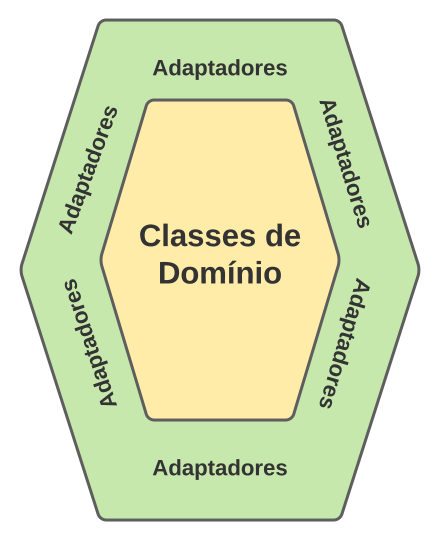
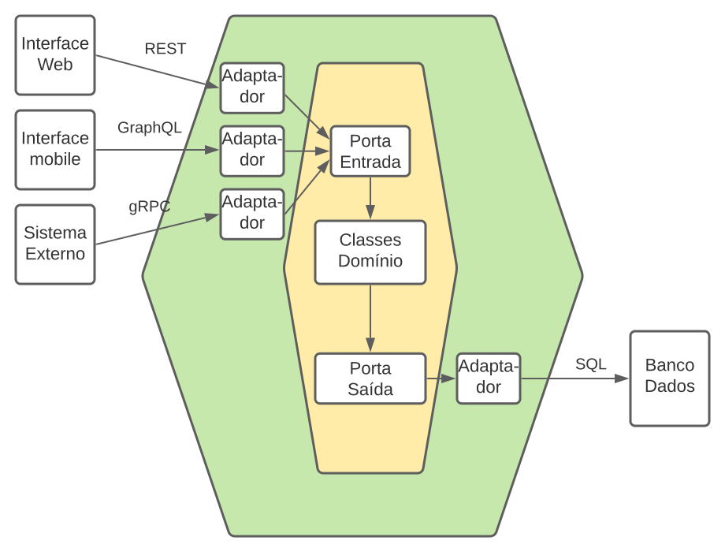

# Arquitetura Hexagonal
## Definição e justificativa:
Básicamente, Arquitetura Hexagonal (também conhecida como Ports and Adapters) é um tipo de arquitetura que divide as classes em dois grupos:
* **Classes de domínio**: que são relacionadas às *regras de negócio*; e
* **Classes de não-domínio**: que são relacionadas com as *infraestruturas*, *tecnologias* e integração com *sistemas externos* (como por ex. *bancos de dados* ou *frameworks*).

Assim, a gente consegue mudar às tecnologias e integrações do sistema (que estão nas classes de *não-domínio*) sem quebrar as regras de negócio que foram criadas anteriormente (nas classes de *domínio*). 

E isso também faz com que as *classes de domínio* possam ser compartilhadas por mais de uma tecnologia (como por ex. mais de uma inteface: um para moblie, outra para desktop, outra para linha de comando, etc.)

Isso trás alguns benefícios que são o Santo Graal da engenharia de software, como:
* **Baixo acoplamento**;
*  **Alta coesão**; e
*  **Independência de tecnologia**.

A mediação entre esses dois grupos de classes é feita por classes que chamamos de **adaptadores**.

## Representação da Arquitetura Hexagonal:

A arquitetura hexagonal é representada visualmente por dois hexágonos concêntricos, onde no hexágono interno ficam as classes de domínio (ou negócio), e no hexágono externo ficam os adaptadores. As classes de não-domínio - onde ficam as tecnologias ou sistemas externos - ficam fora dos hexágonos. Veja:



Cockburn (lmao), criador da arquitetura hexágonal, justificou o uso de um hexágono falando que:
> (...) Cada face do hexágono representa um **motivo** pelo qual o sistema deve se comunicar com o mundo exterior. Por isso **hexágonos** e não **círculos concêntricos**.

Esses motivos podem ser:
* **Interagir** com seus usuários (por intefaces gráficas, Web, mobile, terminal, etc.);
* **Persistir informações** em bancos de dados;
* **Enviar informações** para outros sistemas;
* etc.

## Adaptadores e portas:
Nesse tipo de arquitetura, **porta** se refere ao termo usado às interfaces usadas na comunicação entre as classes de domínio e de não-domínio.
> Obs: Por "interface", a gente se refere exatamente em interfaces de programação mesmo; por exemplo, **interfaces de Java**.

Existem dois tipos de portas:
* **Portas de entrada**; e
* **Portas de saída**.

As **portas de entrada** são interfaces usadas para a comunicação "de fora para dentro". Ou seja, das classes de não-domínio para as classes de domínio. Por exemplo, quando uma classe externa de não-domínio precisa chamar um método de uma classe de domínio.

Logo, essas portas declaram os serviços **providos** pelo sistema. Ou seja, serviços que o sistema oferece para o mundo exterior.

##

As **portas de saída** são interfaces usadas para comunicação "de dentro para fora". Ou seja, das classes de domínio para as classes de não-domínio. Por exemplo, quando uma classe interna precisa chamar um serviço de banco de dados (que se encontra fora do sistema).

Logo, essas portas declaram os serviços **requeridos** do sistema. Ou seja, serviços do mundo exterior que são necessário para o funcionamento do sistema.

---

O importante é saber que as portas são **independentes de tecnologia**. Portanto, se encontrão no hexágono interior.

Sistemas externos normalmente usam algum tipo de tecnologia, como:
* **De comunicação**: REST, gRPC, GraphQL, etc.
* **De bando de dados**: SQL, noSQL, etc.
* **De interação com usuário**: Web, mobile, terminal, etc.

É aí que entram os **adaptadores**, fazendo a ligação entre essas duas partes:
* Recebendo chamadas de métodos de **fora do sistema** e encaminhando essas chamadas para métodos adequados das *portas de entrada*; ou
* Recebendo chamadas de métodos de **dentro do sistema** e direcionando essas para um sistema externo (como um *banco de dados*).

## Exemplo prático

Vamos imaginar um sistema de gerenciamento de bibliotecas que foi desenhado com arquitura hexagonal:



Usuários podem acessar o sistema por meio de três interfaces:
* Web;
* Mobile; e
* Sistema externo.

Cada um desses tipos de acesso tem o método de mensageria e seu adaptador. Mas todos esses adaptadores se conecta com uma **mesma** porta de entrada, que define os métodos específicos do negócio, como pesquisa no catálogo da biblioteca ou realização de emptréstimos, onde esses métodos estão já implementados nas classes de domínio.

Supondo que o usuário faça uma reserva de um livro e o número de itens disponíveis tenham que ser atualizados (e persistidos), o sistema conta com uma porta de saída, que é usada por um adaptador que realiza as operações em um banco de dados relacional.

Um sistema pode ter várias portas de entrada e saída, e em cada porta, podemos plugar vários adaptadores.

Um projeto de exemplo que usa arquitura hexagonal pode ser encontrado [aqui](https://github.com/mtov/ESM-ExemplosCodigo/tree/master/cap7/hexagonal).

Um vídeo explicativo pode ser encontrado [aqui](https://www.youtube.com/watch?v=JxgaUJmWVQQ).

# Exercícios

1. *Em uma Arquitetura Hexagonal, um adaptador é uma implementação do padrão de projeto de mesmo nome. E as portas? Elas podem ser vistas como sendo uma implementação – pelo menos aproximada – de qual padrão de projeto? Se necessário, consulte o Capítulo 6 para responder.*

R: Elas podem ser vistas como uma implementação do padrão "Facade" ou "Interface/Strategy", já que elas definem contratos abstratos que separam o domínio do mundo externo e funcionando como pontos de entrada/saída bem definidos. Basicamente, o Facade oferece uma interface simplficada para um subsistema complexo.

2. *Na figura que mostra a arquitetura hexagonal do sistema de bibliotecas, por que os adaptadores de interface externa (HTTP, GraphQL e REST) e o adaptador de persistência (SQL) estão em faces distintas do hexágono? Eles poderiam ser desenhados na mesma face?*

R: Não, pois eles repesentam tipos de interação diferentes: um de entrada e outro de saída, que usam as portas diferentes apropriadas.

2. *A definição do termo hexagonal é arbitrária, pois, dependendo da aplicação, ela poderia ser chamada de quadrangular, pentagonal, heptagonal, octogonal, etc. Justifique essa afirmação.*

R: O próprio Cockburn supostamente "descobriu" essa arbitrariedade quando viu que cada face do hexágono na verdade só representava os motivos do sistema que ele tinha pensado naquele momento, não necessariamente precisava ser 6. O que importa é o conceito de separação entre o núcleo de negócio e o mundo externo. Por isso também ele tentou renomear a arquitetura para "Arquitetura baseada em portas e adaptores", mas o nome acabou não pegando.

3. *A seguir, mostramos o código de duas classes de domínio que são usadas na documentação do Django, um conhecido framework para construção de aplicações Web em Python. O código mostrado define regras para mapeamento de campos de objetos dessas classes para colunas de tabelas de um BD relacional. Esta implementação segue os princípios de uma arquitetura hexagonal? Justifique sua resposta.*

```
from django.db import models

class Musician(models.Model):
  first_name = models.CharField(max_length=50) 
  last_name = models.CharField(max_length=50)
  instrument = models.CharField(max_length=100)

class Album(models.Model):
  artist = models.ForeignKey(Musician, on_delete=models.CASCADE)
  name = models.CharField(max_length=100)
  release_date = models.DateField()
  num_stars = models.IntegerField()
```

R: Não, pois as classes importam o "models" do django, acoplando a lógica de negócio diretamente o framework. Para seguir o modelo da Arquitetura Hexagonal, as classes de negócio deveriam ser os tais "POPOs" ou "Plain Old Python Objects", sem dependência de infraestrutura.

5. *Descreva, resumidamente, as diferenças entre a Arquitetura Hexagonal e a Arquitetura Limpa (que estudamos em um outro artigo didático).*

R:
| **Aspecto** | **Arq. Hexagonal** | **Arq. Limpa** |
| --- | --- | --- |
|**Estrutura**| Núcelo, portas e adaptadores (sem camadas internas definidas)| Camadas concêntricas explícitas.|
| **Foco** | Isolamento via portas/adaptores | Regra da dependência: camadas externas dependem das internas |
| **Granularidade** | Menos prescritiva internamente | Mais prescritiva: separa entidades de casos de uso |

# Bibliografia

* [Engenharia de Software Moderna](https://engsoftmoderna.info/artigos/arquitetura-hexagonal.html) (Acessado em 2026/03/29

* [Arquitetura Hexagonal: Objetivo, Fundamentos e Estratégias de Implementação](https://medium.com/@joaoluizbueno/arquitetura-hexagonal-objetivo-fundamentos-e-estrat%C3%A9gias-de-implementa%C3%A7%C3%A3o-37d5a7f806a6) (Acessado em 2026/03/30)
.
.
.
.
.
.
.
.
.
.
.
.
.
.
.
.
.