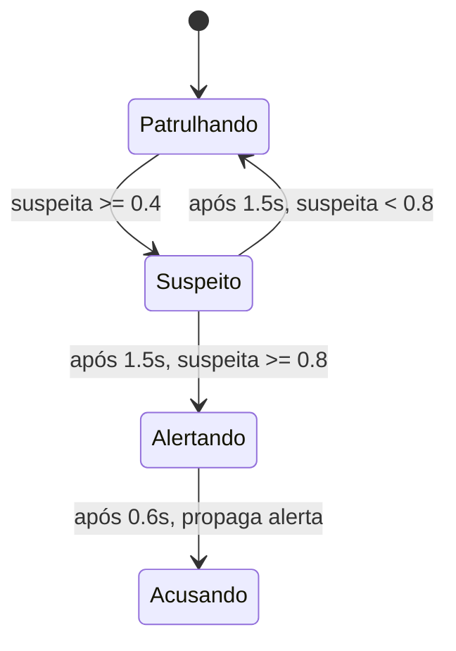

# FSM — brain_fsm.gd

> Obs: Livro de ações é uma lista? Grafo de tarefa é mais complexo

## Estados

| Estado      | Movimento | Descrição |
|-------------|-----------|-----------|
| Patrulhando | patrol    | Comportamento padrão. Anda pelos pontos de patrulha |
| Suspeito    | idle      | Para e avalia as evidências |
| Alertando   | idle      | Teoricamente propaga alerta para NPCs vizinhos, aguarda 0.6s |
| Acusando    | follow    | Persegue o jogador |

## Memória

- `saw_player`: viu o jogador na área restrita (+0.5 suspeita)
- `item_missing`: sabe que o item sumiu (+0.4 suspeita)
- `alert_from`: recebeu alerta de outro NPC (+0.3 suspeita)

## Diagrama

## Eventos externos

- `on_player_spotted()`: NPC viu o jogador no cone de visão dentro da área restrita
- `on_item_missing()`: notificado pelo main que o item desapareceu
- `on_alert_received(from_id)`: recebeu alerta propagado por outro NPC