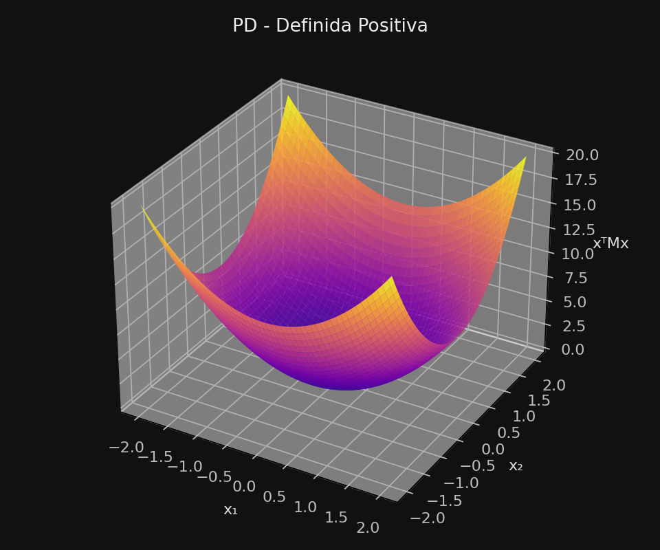
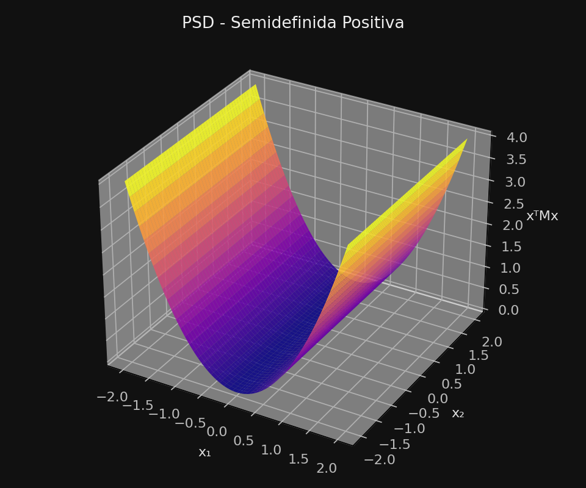
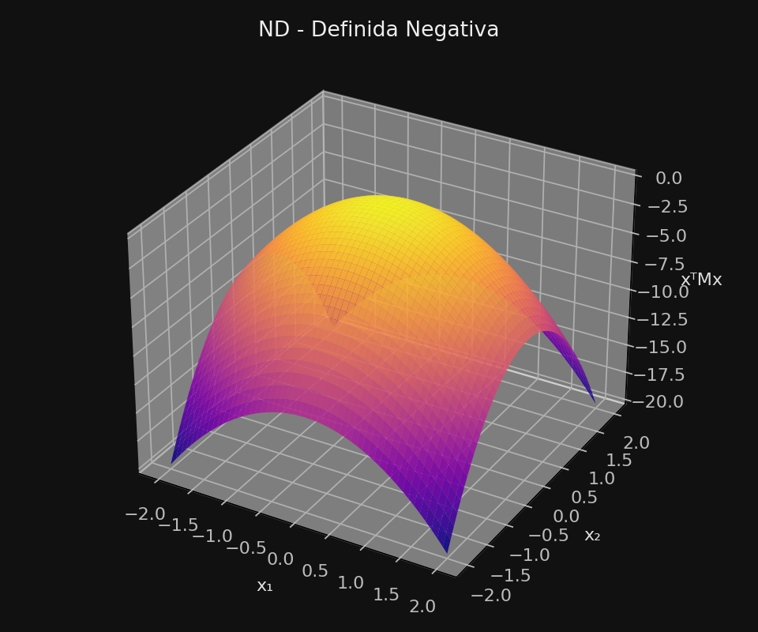
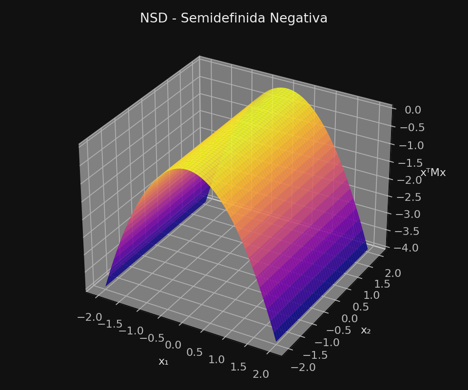
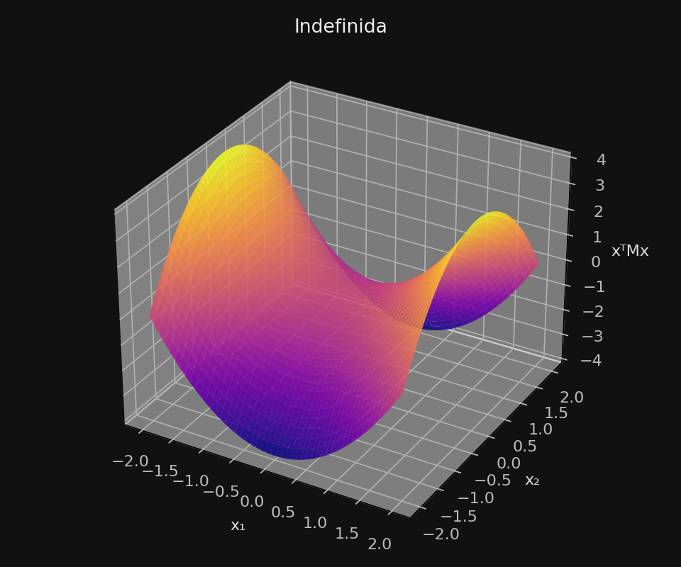

# Gradiente
## Definição:
Basicamente, o Gradiente ($\nabla f(x)$) representa a inclinação da função no ponto $x$. Ela diz o quanto a função "sobe" ou "desce" em cada direção da função.

## Definição formal:

$$
\nabla f(x) = 

\begin{bmatrix}
	\frac {\delta f(\bar x)} {\delta x_1} , 
	\frac {\delta f(\bar x)} {\delta x_2} , 
	\cdots , 
	\frac {\delta f(\bar x)} {\delta x_n}
\end{bmatrix}^T
$$

> Obs: $[\dots]^T$ siginifica "matriz *transposta*". Ou seja, colunas viram linhas, e vice-versa.

## Regra da derivada parcial:

$$
\boxed {
	\frac {\delta(x^n)} {\delta x} = n * ax^{n-1}
}
$$

## Exercício de exemplo:

$$
f(x) = 
4x_1²  5x_2⁴ + 
6x_2⁴ 2x_3³
$$

### Resolução:

#### $x_1$:

$$
\frac {\delta f(\bar x)} {\delta x_1} = {{\delta \over \delta x_1} (4x_1²  5x_2⁴)}
$$

$$
\downarrow 
$$

$$
\frac {\delta (4x_1²  5x_2⁴)}{\delta x_1} + \frac {\delta (6x_2⁴ 2x_3³)}{\delta x_1}
$$

Não tem o X1 no segundo termo, então o primeiro termo fica igual:

$$
\frac {\delta (4x_1²  5x_2⁴)}{\delta x_1} + \cancel{\frac {\delta (6x_2⁴ 2x_3³)}{\delta x_1}}
$$

$$
\frac {\delta (4x_1²  5x_2⁴)}{\delta x_1} + 0
$$

$$
\frac {\delta (4x_1²  5x_2⁴)}{\delta x_1}
$$

X2 não tem influência no X1, então ele continua do mesmo jeito:

$$
\frac {\delta}{\delta x_1} {(4x_1²)} * 5x_2⁴
$$

Aplicamos aquela regra:

$$
\boxed {
	\frac {\delta(x^n)} {\delta x} = n * ax^{n-1}
}
$$

$$
\therefore 
$$

$$
2*4x_1^{2-1} * 5x_2⁴
$$

$$
8x_1 * 5x_2⁴
$$

$$
8*5x_1 x_2⁴
$$

$$
40x_1 x_2⁴
$$

$$
\therefore \frac {\delta f(\bar x)} {\delta x_1} 
=  \boxed{40x_1 x_2⁴}
$$

* * *

####  $x_2$:

$$
\frac {\delta f(\bar x)} {\delta x_2} 
$$

$$
\downarrow 
$$

$$
\frac {\delta (4x_1²  5x_2⁴)}{\delta x_2} + \frac {\delta (6x_2⁴ 2x_3³)}{\delta x_2}
$$

Como o x2 tem nos dois, não cancela nenhum.

$$
\frac {\delta (4x_1²  5x_2⁴)}{\delta x_2} + \frac {\delta (6x_2⁴ 2x_3³)}{\delta x_2}
$$

X1 e X3 não tem influência no X2, então eles continuam do mesmo jeito:

$$
4x_1² * \frac {\delta}{\delta x_2} {(5x_2⁴)} 
+
\frac {\delta}{\delta x_2} {(6x_2⁴)} * 2x_3³
$$

Aplicamos a regra:

$$
4x_1² * (4*5x_2^{4-1})
+
(4*6x_2^{4-1}) * 2x_3³
$$

$$
4x_1² * 20x_2^{3}
+
24x_2^3 * 2x_3³
$$

$$
20*4x_1² x_2^{3}
+
2*24x_2^3 x_3³
$$

$$
80x_1² x_2^{3}
+
48x_2^3 x_3³
$$

$$
\therefore \frac {\delta f(\bar x)} {\delta x_2} 
=  \boxed{80x_1² x_2^{3}
+
48x_2^3 x_3³}
$$

* * *

#### $x_3$:

$$
\frac {\delta f(\bar x)} {\delta x_3} 
$$

$$
\downarrow 
$$

$$
\frac {\delta (4x_1²  5x_2⁴)}{\delta x_3} + \frac {\delta (6x_2⁴ 2x_3³)}{\delta x_3}
$$

Como o x3 não tem no primeiro termo, cancelamos ele.

$$
\cancel {\frac {\delta (4x_1²  5x_2⁴)}{\delta x_2}} + \frac {\delta (6x_2⁴ 2x_3³)}{\delta x_2}
$$

$$
0 + 
\frac {\delta (6x_2⁴ 2x_3³)}{\delta x_2}
$$

X2 não afeta X3, então é como uma constante:

$$
6x_2^4 * \frac {\delta}{\delta x_3}(2x_3^2)
$$

Aplicamos a regra da derivada parcial:

$$
6x_2^4 * (2*2x_3^{2-1})
$$

$$
6x_2^4 * 4x_3
$$

$$
4*6x_2^4 x_3
$$

$$
24x_2^4 x_3
$$

$$
\therefore \frac {\delta f(\bar x)} {\delta x_3} 
=  \boxed{
	24x_2^4 x_3
}
$$

* * *

###  - Final

Agora é só juntar tudo:

$$
\nabla f(x) = 

\begin{bmatrix}
	\frac {\delta f(\bar x)} {\delta x_1} , 
	\frac {\delta f(\bar x)} {\delta x_2} , 
	\cdots , 
	\frac {\delta f(\bar x)} {\delta x_n}
\end{bmatrix}^T
=
\begin{bmatrix}
	\\
	\frac {\delta f(\bar x)} {\delta x_1} \\ 
	\\
	\frac {\delta f(\bar x)} {\delta x_2} \\
	\\
	\vdots \\
	\\
	\frac {\delta f(\bar x)} {\delta x_n} \\
	\\
\end{bmatrix}
=
\begin{bmatrix}
	\\
	\frac {\delta f(\bar x)} {\delta x_1} \\ 
	\\
	\frac {\delta f(\bar x)} {\delta x_2} \\
	\\
	\frac {\delta f(\bar x)} {\delta x_3} \\
	\\
\end{bmatrix}
$$

As soluções encontradas foram:
	
$\frac {\delta f(\bar x)} {\delta x_1} =  \boxed{40x_1 x_2⁴}$ 
$\frac {\delta f(\bar x)} {\delta x_2} =  \boxed{80x_1² x_2^{3} + 48x_2^3 x_3³}$
$\frac {\delta f(\bar x)} {\delta x_3} =  \boxed{24x_2^4 x_3}$

Logo:

$$
\boxed
{
	\nabla f(x) =
	\begin{bmatrix}

		40x_1 x_2⁴ \\
		\\
		80x_1² x_2^{3} + 48x_2^3 x_3³ \\
		\\
		24x_2^4 x_3 \\ 
		
	\end{bmatrix}
}
$$

# Hessiana

## Definição
Se o Gradiente mostra a **direção** do crescimento, a Hessiana mostra a **curvatura**: se é mínimo, máximo, ou se é uma sela. Ela mostra como a **curvatura da função *muda*** em cada direção

A **Hessiana**, denotada por $H(x)$, é a matriz de *segundas derivadas* de uma função mutlivariável.

## Definição formal:
Se:
$$
f(x_1 , x_2, \dots, x_n)
$$
é uma função de várias variáveis, então:
$$
H(x) = 

\begin{bmatrix}
	\\
	{\delta² f \over \delta x_1²} & {\delta² f \over \delta x_1 \delta x_2} & \cdots & {\delta² f \over \delta x_1 \delta x_n} 
	\\ \\
	{\delta² f \over \delta x_2 \delta x_1} & {\delta² f \over \delta x_2²} & \cdots & {\delta² f \over \delta x_2 \delta x_n}
	\\ \\
	\vdots & \vdots & \ddots & \vdots
	\\ \\
	{\delta² f \over \delta x_n \delta x_1} & {\delta² f \over \delta x_n \delta x_2} & \cdots & {\delta² f \over \delta x_n²}
	\\ \\
\end{bmatrix}

$$

> Adendo:
> Para fazer a segunda derivada parcial ($\delta² f \over \delta x_n$), é só fazer a derivada parcial de uma derivada parcial (${\delta \over \delta x_n} ({\delta \over \delta x_n})$)
> Por exemplo, se ${\delta f \over \delta x_1} = 6x_1 x_2³$, então ${\delta² f \over \delta x_1²} = 6x_2³$

---
# Matriz Definida Positiva e Semipositiva

Definição:

> A positividade de uma matriz está relacionada à *curvatura* da função.
> $x^TMx$ diz o **tipo da curvatura**

## Tipos de matrizes:

|Tipo de Matriz|Condição matemática|Interpretação
|:---:|:---:|:---:|
|**Definida Positiva**  (PD)|${{x^TMx > 0}, \forall ~ x \ne 0}$| Curvatura sem pra cima $\to$ **mínimo local**
|**Semidefinida Positiva**   (PSD)|${x^TMx \ge 0, \forall ~ x \ne 0}$|Pode ser plana em algumas direções $\to$ **mínimo ou ponto plano** |
|**Definida Negativa**   (ND)|${x^TMx < 0, \forall x \ne 0~}$|Curvatura sempre pra baixo $\to$ **máximo local**|
|**Semidefinida Negativa**   (NSD)|${x^TMx \le 0, \forall ~ x \ne 0}$|Pode ser plana em algumas direções $\to$ **máximo ou ponto plano**|
|**Indefinida**|$\exists~ x,y: {x^TMx > 0} \land {y^TMy < 0}$|Curvatura muda de sinal $\to$ **ponto de sela**|

Exemplos (de $x^TMx$, onde $M$ é uma matriz 2x2) em gráficos:

	
### **Definida Positiva (PD)**

### **Semidefinida Positiva (PSD)**

### **Definida Negativa (ND)**

### **Semidefinida Negativa (NSD)**

### **Indefinida**

### Exemplo dado nos slides:

$$
M = 
\begin{bmatrix}
	8 & -1 \\
	-1 & 1
\end{bmatrix}
$$

Essa matriz ainda é considerada **Definida Positiva (PD)**

Pra ver isso, devemos observar que: 
 
$$
x \ne 0:x = 
\begin{bmatrix}
	x_1 \\
	x_2
\end{bmatrix}
$$

$$
\therefore
$$

$$
	x^TMx=
\begin{bmatrix}
	x_1 & x_2
\end{bmatrix}

\begin{bmatrix}
	m_{11} & m_{12} \\
	m_{21} & m_{22}
\end{bmatrix}

\begin{bmatrix}
	x_1 \\
	x_2
\end{bmatrix}
$$

$$
	x^TMx=
\begin{bmatrix}
	x_1 & x_2
\end{bmatrix}

\begin{bmatrix}
	8 & -1 \\
	-1 & 1
\end{bmatrix}

\begin{bmatrix}
	x_1 \\
	x_2
\end{bmatrix}
$$
$$
 x^TMx=8x_1² - 2x_1x_2 + x_2²
$$

$$
x^TMx= 7x_1² + (x_1 - x_2)² \gt 0
$$

Não dá pra ter um número negativo (menor que zero) dessa equação pelo simples fato de que não dá pra tirar um número negativo de um número qualquer elevado a 2. Só é $0$ se $x_1$ e $x_2$ forem $0$ (e não são).
