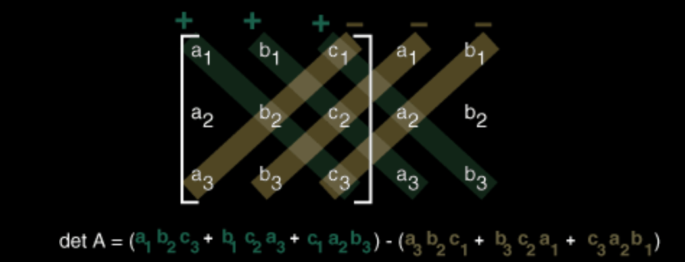

# Existência de soluções ótimas

Tópicos aqui são concentrados em:

- **Existência de soluções ótimas:**
    - Verificar quando um problema realmente tem uma solução mínima (ou máxima);
- **Caracterização de soluções ótimas:**
    - Como identificar matematicamente se um determinado ponto é ótimo;
- **Algoritmos para computar a solução ótima:**
    - Métodos para chegar nessa solução.

&nbsp;

Ou seja, tudo pela **solução ótima**.

&nbsp;

Para ilustrar a busca pela solução ótima:

## Exemplo 1:

**Minimize $x$, para $1+x \over 2x$, sujeito à $x \ge 1$.**

Podemos reescrever a função como sendo:

$$
f(x) = {1+x \over 2x} = \boxed{{1 \over 2x} + {1 \over 2}}
$$

A medida que o $x$ aumenta, o termo $1 \over 2x$ vai diminuindo, e tende a $0$.

Logo, $f(x)$ tende a $1 \over 2$, mas, crucialmente, **nunca atinge esse valor** (só se aproxima).

Nesse caso, não temos como achar a solução ótima, pois a região factível não é limitada. (a região factível sendo $x \ge 1$. Ou seja, ela - o domínio - tende ao **infinito**)

$$
\boxed{x \to \infin}
$$

> Basicamente, o valor ótimo existe na teoria: seria o $1 \over 2$ ou $0.5$.  
> Mas não tem um ponto $x$ dentro da região factível onde isso acontece.

A função melhora infinitamente, mas nunca chega a ser *"a ótima"*.

A **limitação do domínio** é essencial pra garantir que um ótimo exista.

## Exemplo 2:

**Minimize $1 \over x$, sujeito à: $1 \le x < 2$**

O domíno da função é aberto **para direita**. O $x$ pode ser somente menor que 2, nunca igual.

Quando $x$ se aproxima de 2:

$$
{1 \over x} = {1 \over 2} = 0.5
$$

Mas o esse valor também nunca é atingido, porque 2 não tá na **região factível**

Logo, a função *tende* a mínimo, mas **não tem um ponto ótimo** dentro do conjunto permitido.

## Exemplo 3:

**Minimize a função $f(x)$, sujeito à: $1 \le x \le 2$, onde:**

$$
f(x) = \begin{cases}
	{1 / x} &\text{se: } x < 2 \\
	{1} &\text{se: } x = 2
\end{cases}
$$

Nesse caso, o conjunto factível é **fechado**: inclui o 2.

Mesmo assim, não é contínuo: $f(2) = 1$, que seria maior que, por exemplo: $f(1.9) \approx 0.526...$

Logo, o $2$ existe no conjunto factível, mas **ainda não é um ponto ótimo**. Então ainda não há pontos ótimos para essa função.

Para problemas irrestritos:

## Exemplo 4:

> Ou seja, **sem restrições** além da função a ser minimizada.

**minimize $f(x)$, sujeito a $x \in X$, onde:**

$x = [x_1, x_2, \dots, x_n]$

$f(x): \reals^n \to \reals$

$X$ é o conjunto de possíveis valores de $x$  
(No caso **irrestrito**, $X = \reals^n$, ou seja, não há limites. $x$ pode assumir qualquer valor real)

## Direção Descendente

A **direção descendente** é uma direção no espaço de busca onde a função **diminui**

- Definição Formal:
    

**A direção $\overrightarrow d$** é a *descendente* em $x = \bar x$ se:

$$
  f(\bar x + \epsilon \overrightarrow{d}) < f(\bar x),
$$

$$
 \forall \epsilon > 0 ~ \text{(e suficientemente pequeno)}
$$

O conceito, pelo menos, é realmente simples: só diz qual que é a direção que se deve andar para o valor diminuir.

Agora vamos ver o **por que** o gradiente negativo é uma *direção de descida* (direção em que a função diminui)

## Teorema:

Se $f(x)$ é **diferenciável\*** em $\bar x$ e existe um vetor $d$ tal que:

$$
\nabla f(\bar x)^Td < 0
$$

Então, para $\lambda > 0$, e suficientemente pequeno:

$$
f(\bar x + \lambda d) < f(\bar x)
$$

Isso quer dizer que $d$ é uma **direção de descida** em $f(x)$ no ponto $\bar x$

> **Adendo**: Ser uma função ser **diferenciável** em um ponto significa que ela é **"suave" o bastante nesse ponto**.  
> Ou seja, ela não tem quebra, canto, salto, ou mudança brusca de inclinação. Tem uma taxa de variação bem definida (um gradiente) naquele ponto. Isso garante uma reta tangente bem definida nele, como se desse pra "colocar uma régua" pra ver a inclinação!

## Prova passo a passo:

1 - Pela definição de derivada, podemos escrever uma aproximação:

$$
	f(\bar x + \lambda d) = f(\bar x) + \lambda \nabla f(\bar x)^Td + \lambda || d || \alpha(\bar x, \lambda d)
$$

O termo $\alpha(\bar x, \lambda d)$ é um erro que tende a zero quando $\lambda \to 0.$

2 - Reanjando, temos:

$$
	{f(\bar x + \lambda d) - f(\bar x) \over \lambda} = \nabla f(\bar x)^Td+||d||\alpha(\bar x, \lambda d)
$$

3 - Quando $\lambda$ é pequeno:

$$
\alpha(\bar x, \lambda d) \to 0
$$

Então, o comportamento é dominado pelo termo:

$$
\nabla f(\bar x)^Td
$$

4 - Se esse termo - **o gradiente** - é **negativo**, então:

$$
f(\bar x + \lambda d) < f(x\bar x)
$$

## Intuição:

1 - $\nabla f(\bar x)$ (o gradiente da função $f$ no ponto $\bar x$), sempre aponta na direção de maior crescimento da função;  
2 - Logo, $- \nabla f(\bar x)$ aponta na direção de maior **decrescimento**.

Esse teorema formaliza exatamente isso:

Se o produto escalar $\nabla f(\bar x)^Td < 0$, então $d$ é uma direção "para baixo"

## Corolário:

Se $f(x)$ é diferenciável em $\bar x$, e $\bar x$ é um mínimo local, então:

$$
\nabla f(\bar x) = 0
$$

O gradiente $\nabla f(x)$ aponta sempre pra **direção de maior crescimento** da função.  
Se no ponto $\bar x$ você já tá no mínimo, então não tem direção pra onde a função diminui mais ainda

Logo, nenhuma direção descente existe, o que implica no $\nabla f(\bar x) = 0$

Basicamente:

> Se um ponto é mínimo local, a inclinação da função naquele ponto precisa ser nula; a superfície "fica plana".

Esse corolário é a condição necessária de **primeira ordem** para um problema de minimização irrestrito. Ou seja, depende só do **gradiente** (primeira derivada)

Agora vamos ver a condição de **segunda ordem**, que envolve a **Hessiana**:

## Teorema 2:

Se $f(x)$ é **duas vezes diferenciável** em $\bar x$, e $\bar x$ é um **mínimo local**, então:

$$
\nabla f(\bar x) = 0
\\
\text{e}
\\
H(\bar x) \text{ é Semidefinida Positiva (PD)}
$$

Porque precisamos disso?

- O gradiente (o $\nabla f(x)$) só diz que a inclinação é zero, mas **não garante que o ponto é mínimo**.
- Ele pode ser também um *máximo* ou um *ponto de sela*.

É aí que entra a **segunda derivada**, a **Hessiana** $H(\bar x)$.

Por que se ela é **semidefinida positiva**, isso significa que a função é "voltada pra cima", tipo uma sorriso, uma bacia ou um "U".

Se fosse negativa, seria máxima. Se tivesse sinais mistos, seria um ponto de sela

## Prova:

1.  Pela **condição de 1ª ordem**, já temos que $\nabla f(\bar x) = 0$.
2.  Agora, supomos **por contradição** que $H(\bar x)$ **não** é semidefinida positiva.
3.  Então existe uma direção $d$ tal que:

$$
d^TH(\bar x)d<0
$$

Isso significa que, andando nessa direção, a função **decresce** (diminui), e a curvatura é pra baixo.  
4\. Agora, expandindo $f(\bar x + \lambda d)$ com a **aproximação de Taylor**:

$$
f(\bar x + \lambda d) = f(\bar x) + {1 \over 2} \lambda² d^T H(\bar x) d + \lambda² ||d||² \alpha(\bar x, \lambda d)
$$

(O termo $\alpha$ tende a zero quando $\lambda \to 0$)

5.  Como $d^T H(\bar x) d < 0$, o lado direito fica **menor** que $f(\bar x)$.
6.  O que contradiz o fato de que $\bar x$ seria um **mínimo local**.

Logo, a Hessiana $H(\bar x)$ precisa ser **semidefinida positiva** pra garantir que a curvatura local é "pra cima".

## Outra visualização:

1.  Pra $f(x) = x^2$:
    
    1.  $f"(x) = 2 > 0$
    2.  A curvatura é **pra cima**
    3.  Então é mínimo
2.  Pra $f(x) = -x^2$:
    
    1.  $f"(x) = -2 < 0$
    2.  A curvatura é **pra baixo**
    3.  Então é máximo

Em várias dimensões, a Hessiana $H(x)$ generaliza essa ideia de "curvatura"

# Exercício pŕatico da aplicação de condições de otimalidade:

Função do exercício:

$$
f(x) = {1 \over 2} x_1² + x_1 x_2 + 2x_2² - 4x_1 - 4x_2 - x_2³
$$

Essa função tem duas variáveis: $x_1$ e $x_2$.

## Passo 1: Achar o gradiente $\nabla f(x)$

O gradiente é aquele vetor das derivadas parciais:

$$
\nabla f(x) = 
\begin{bmatrix}
	\\
	{\partial f \over \partial x_1} \\
	\\
	{\partial f \over \partial x_2} \\
	\\
\end{bmatrix}
$$

### Fazendo as derivadas parciais:

#### Para $x_1$:

$$
{\partial f \over \partial x_1} = {\partial \over \partial x_1} ({1 \over 2} x_1² + x_1 x_2 + 2x_2² - 4x_1 - 4x_2 - x_2³)
$$

$$
{\partial \over \partial x_1} ({1 \over 2} x_1²) + {\partial \over \partial x_1} (x_1 x_2) - {\partial \over \partial x_1} (4x_1)
$$

$$
(2*{1 \over 2} x_1^{2-1}) +  (1*x_1^{1-1} *x_2) - (1*4*x_1^{1-1})
$$

$$
(\cancel2*{1 \over \cancel2} x_1^{1}) +  (1*x_1^{0} *x_2) - (1*4*x_1^{0})
$$

$$
(1 x_1) +  (1*1* x_2) - (1*4*1)
$$

$$
x_1 +  x_2 - 4
$$

$$
\therefore {\partial f \over \partial x_1} = \boxed{x_1 +  x_2 - 4}
$$

#### Para $x_2$:

$$
{\partial f \over \partial x_2} = {\partial \over \partial x_2} ({1 \over 2} x_1² + x_1 x_2 + 2x_2² - 4x_1 - 4x_2 - x_2³)
$$

$$
{\partial \over \partial x_2}(x_1 x_2) + {\partial \over \partial x_2}(2x_2²) - {\partial \over \partial x_2}(4x_2) - {\partial \over \partial x_2}(x_2³)
$$

$$
(x_1 * 1 * x_2^{1-1}) + (2*2x_2^{2-1}) - (1*4x_2^{1-1}) - (3*x_2^{3-1})
$$

$$
(x_1 * 1 * x_2^{1-1}) + (2*2*x_2^{2-1}) - (1*4*x_2^{1-1}) - (3*x_2^{3-1})
$$

$$
(x_1 * 1 * 1) + (2*2x_2^{1}) - (1*4*1) - (3*x_2^{2})
$$

$$
(x_1) + (4x_2) - (4) - (3x_2^{2})
$$

$$
\therefore {\partial f \over \partial x_2}= \boxed{x_1 + 4x_2 - 4 - 3x_2^{2}}
$$

Então:

$$
{\partial f \over \partial x_1} = x_1 + x_2 -4
$$

$$
{\partial f \over \partial x_2} = x_1 + 4x_2 - 4 - 3x_2²
$$

Logo:

$$
\nabla f(x) = 
\begin{bmatrix}
	x_1 + x_2 - 4 \\
	x_1 + 4x_2 - 4 - 3x_2²
\end{bmatrix}
$$

## Passo 2: Encontrar os pontos críticos

Os pontos críticos da função são os pontos onde o gradiente $\nabla f(x) = 0$, ou seja, onde a **inclinação é nula**.

Agora vamos resolver o sistema:

$$
\begin{cases}
   x_1 + x_2 - 4 = 0 \\
   x_1 + 4x_2 - 4 - 3x_2² = 0
\end{cases}
$$

Na primeira equação, isolando o $x_1$, temos:

$$
x_1 = 4 - x_2
$$

Substituindo $x_1$ na segunda equação, temos:

$$
(4 - x_2) + 4x_2 - 4 - 3x_2² = 0
$$

$$
3x_2 - 3x_2² = 0
$$

$$
3x_2(x_2 - 1) = 0
$$

Os únicos valores de $x_2$ que poderiam fazer essa equação ser verdade são: $0$ ou $1$:

#### $x_2 = 0$:

$$
3*0(0-1)=0
\\
0*-1=0
\\
0=0
$$

#### $x_2 = 1$ :

$$
3*1(1-1) = 0 \\
3(0)=0 \\
0 = 0
$$

#### Se $x_2=0$, então $x_1$:

$$
x_1 = 4 - 0 \\
x_1 = 4
$$

#### Se $x_2=1$, então $x_1$:

$$
x_1 = 4 - 1 \\
x_1 = 3
$$

### Logo, os pontos críticos são:

$(4, 0)$  
e  
$(3 ,1)$

## Passo 3: Achar a Hessiana $H(x)$

A Hessiana é a **matriz de segundas derivadas:**

Ela segue o padrão das segundas derivadas de:

$$
\begin{bmatrix}
x_1x_1 & x_1x_2 \\
x_2x_1 & x_2x_2
\end{bmatrix}
$$

Logo

$$
H(x) =
\begin{bmatrix}
{\partial²f \over x_1x_1} & {\partial²f \over x_1x_2} \\
{\partial²f \over x_2x_1} & {\partial²f \over x_2x_2}
\end{bmatrix} 
$$

ou

$$
H(x)=
\begin{bmatrix}
{\partial²f \over x_1²} & {\partial²f \over x_1x_2} \\
{\partial²f \over x_2x_1} & {\partial²f \over x_2²}
\end{bmatrix} 
$$

Agora, só precisamos fazer as segundas derivadas:

$$
{\partial²f \over x_1²} = {\partial \over x_1} ({\partial f \over x_1}) = {\partial \over x_1}(x_1 + \cancel x_2 - \cancel 4) = 1
$$

$$
{\partial²f \over x_2²} = {\partial \over x_2}({\partial f \over x_2}) = {\partial \over x_2}(\cancel x_1 + 4x_2 - \cancel 4 - 3x_2²) =  4 - 6x_2
$$

$$
{\partial²f \over x_1x_2} = {\partial \over x_1} ({\partial f \over x_2}) = {\partial \over x_1}(x_1 + \cancel 4x_2 - \cancel 4 - \cancel 3x_2²) = 1
$$

$$
{\partial²f \over x_2x_1} = {\partial \over x_2} ({\partial f \over x_1}) = {\partial \over x_1}(\cancel x_1 + x_2 - \cancel 4) = 1
$$

Então, a matrix $H(x)$ é:

$$
H(x) = 
\begin{bmatrix}
1 & 1 \\
1 & 4 - 6x_2
\end{bmatrix}
$$

## Passo 4: Classificar os pontos

Agora, vamos avaliar a Hessiana em cada ponto:

#### 1\. Em $(4, 0)$:

$$
H(4, 0) = 
\begin{bmatrix}
1 & 1 \\
1 & 4
\end{bmatrix}
$$

Calculando a determinante para uma matriz $A$:

$$
A = 
\begin{bmatrix}
	a & b \\
	c & d 
\end{bmatrix}
$$

Então o **determinante** é:

$$
det(A) = ad - bc
$$

Logo:

$$
det(H(4,0)) = 1*4 - 1*1 = 4 - 1 = 3
$$

Como o determinante dessa matriz é **positivo**, e o elemento $H_{11} = 1 > 0$, a matriz é **definida positiva**, então é **mínimo local**.

#### 2\. Em (3, 1):

$$
H(3, 1) = 
\begin{bmatrix}
1 & 1 \\
1 & -2
\end{bmatrix}
$$

Calculando a determinante para uma matriz $A$:

$$
A = 
\begin{bmatrix}
	a & b \\
	c & d 
\end{bmatrix}
$$

Então o **determinante** é:

$$
det(A) = ad - bc
$$

Logo:

$$
det(H(3,1)) = 1*-2 - 1*1 = -2 - 1 = -3
$$

Como o determinante dessa matriz é **negativo**, a matriz é **indefinida**, então é **ponto de sela**.

## Resposta final:

Os pontos críticos são

- (4,0): Mínimo local
- (3,1): Ponto de sela  
    
    .png)
    
    output(10).png
    

# Mais um exercício prático:

Ache os candidatos a mínimos e máximos locais da função:

$$
f(x) = (2x_1 - x_2)² + (3x_1 - x_3)² + (3x_2 - 2x_3)²
$$

## 1\. Achar o gradiente $\nabla f(x)$

#### $x_1$:

$$
{\partial f \over \partial x_1} = {\partial \over \partial x_1}( (2x_1 - x_2)² + (3x_1 - x_3)² + \cancel{(3x_2 - 2x_3)²}) 
$$

$$
={\partial \over \partial x_1}(2x_1 - x_2)² + {\partial \over \partial x_1}(3x_1 - x_3)²
$$

$$
=2(2x_1 - x_2) * {\partial \over \partial x_1}(2x_1 - x_2) + 2(3x_1 - x_3) + {\partial \over \partial x_1}(3x_1 - x_3)
$$

$$
=2(2x_1 - x_2) * 2 + 2(3x_1 - x_3) * 3
$$

$$
=4(2x_1 - x_2) + 6(3x_1 - x_3)
$$

$$
=8x_1 - 4x_2 + 18x_1 - 6x_3
$$

$$
=26x_1 - 4x_2 - 6x_3
$$

$$
\therefore {\partial f \over \partial x_1} = \boxed{26x_1 - 4x_2 - 6x_3}
$$

#### $x_2$:

$$
{\partial f \over \partial x_2} = {\partial \over \partial x_2}( (2x_1 - x_2)² + \cancel{(3x_1 - x_3)²} + (3x_2 - 2x_3)²) 
$$

$$
 =  {\partial \over \partial x_2}(2x_1 - x_2)² + {\partial \over \partial x_2}(3x_2 - 2x_3)²
$$

$$
 =  2(2x_1 - x_2)*{\partial \over \partial x_2}(2x_1 - x_2) + 2(3x_2 - 2x_3)*{\partial \over \partial x_2}(3x_2 - 2x_3)
$$

$$
 =  2(2x_1 - x_2)*-1 + 2(3x_2 - 2x_3)*3
$$

$$
 =  -2(2x_1 - x_2) + 6(3x_2 - 2x_3)
$$

$$
 =  -4x_1 + 2x_2 + 18x_2 - 12x_3
$$

$$
 =  -4x_1 + 20x_2 - 12x_3
$$

$$
\therefore {\partial f \over \partial x_2} = \boxed{-4x_1 + 20x_2 - 12x_3}
$$

#### $x_3$:

$$
{\partial f \over \partial x_3} = {\partial \over \partial x_3}( \cancel{(2x_1 - x_2)²} + (3x_1 - x_3)² + (3x_2 - 2x_3)²) 
$$

$$
= {\partial \over \partial x_3}(3x_1 - x_3)² + {\partial \over \partial x_3}(3x_2 - 2x_3)²
$$

$$
= {\partial \over \partial x_3}(3x_1 - x_3)² + {\partial \over \partial x_3}(3x_2 - 2x_3)²
$$

$$
= 2(3x_1 - x_3)*{\partial \over \partial x_3}(\cancel {3x_1} - x_3) + 2(3x_2 - 2x_3)*{\partial \over \partial x_3}(\cancel{3x_2} - 2x_3)
$$

$$
= 2(3x_1 - x_3)*-1 + 2(3x_2 - 2x_3)*-2
$$

$$
= -2(3x_1 - x_3) - 4(3x_2 - 2x_3)
$$

$$
= -6x_1 + 2x_3 - 12x_2 + 8x_3
$$

$$
= -6x_1 - 12x_2 + 10x_3
$$

$$
\therefore {\partial f \over \partial x_3} = \boxed{-6x_1 - 12x_2 + 10x_3}
$$

#### Logo:

$$
\nabla f(x) = 
\begin{bmatrix}
26x_1 - 4x_2 - 6x_3 \\
-4x_1 + 20x_2 - 12x_3 \\
-6x_1 - 12x_2 + 10x_3 
\end{bmatrix}
$$

## Passo 2: Encontrar os pontos críticos

Lembrando que os pontos críticos são onde o gradiente é 0.

Agora vamos resolver o sistema:

$$
\begin{cases}
26x_1 - 4x_2 - 6x_3 = 0 \\
-4x_1 + 20x_2 - 12x_3 = 0 \\
-6x_1 - 12x_2 + 10x_3 = 0
\end{cases}
$$

Assumindo que $x_1$ é:

$$
-4x_1 + 20x_2 - 12x_3 = 0
$$

$$
4x_1 = 20x_2 - 12x_3
$$

$$
x_1 = 5x_2 - 3x_3
$$

Logo:

$$
-6x_1 - 12x_2 + 10x_3 = 0
$$

$$
-6(5x_2 - 3x_3) - 12x_2 + 10x_3 = 0
$$

$$
-30x_2 + 18x_3 - 12x_2 + 10x_3 = 0
$$

$$
-42x_2 + 28x_3= 0
$$

$$
42x_2 = 28x_3
$$

$$
x_2 = {28 \over 42}x_3
$$

$$
x_2 = {14 \over 21}x_3
$$

$$
x_2 = {2 \over 3}x_3
$$

Então:

$$
x_1 = 5x_2 - 3x_3
$$

$$
x_1 = 5({{2 \over 3} x_3} )- 3x_3
$$

$$
x_1 = {{10 \over 3} x_3}- 3x_3
$$

$$
x_1 = {{10 \over 3} x_3}- {9 \over 3}x_3
$$

$$
x_1 = {1 \over 3}x_3
$$

Checando na 3:

$$
-6x_1 - 12x_2 + 10x_3 = 0
$$

$$
-6({1 \over 3}x_3) - 12({2 \over 3}x_3) + 10x_3 = 0
$$

$$
-{6 \over 3}x_3 - {24 \over 3}x_3 + 10x_3 = 0
$$

$$
-2x_3 - 8x_3 + 10x_3 = 0
$$

$$
-10x_3 + 10x_3 = 0
$$

$$
0 = 0 \space \checkmark
$$

Como ambos $x_1$ e $x_2$ são representados em função de $x_3$, e $x_3$ pode ser qualquer número real, existe uma **reta** com **infinitos pontos mínimos** na função.

$$
f(x) = (2x_1 - x_2)² + (3x_1 - x_3)² + (3x_2 - 2x_3)²
$$

Isso acontece por que a função $f(x)$ zera quando:

$$
2x_1 = x_2 \\ 3x_1 = x_3 \\ 3x_2 = 2x_3
$$

Que é satisfeito por todos os pontos da reta do vetor $v(1,2,3)$, $v$ pertencendo ao domínio dos números reais ($v \in \reals$).

Outro método que poderíamos ter usado é o fato de que como $f(x)$ é uma função de soma de quadrados, $f(x) \ge 0$ para todo $x$. Logo, ele só é zero quandoas funções são zero:

$$
\begin{cases}
2x_1 - x_2 = 0 \\ 
3x_1 - x_3 = 0 \\ 
3x_2 - 2x_3 = 0
\end{cases}
$$

Assim, acharíamos o vetor da reta da mesma maneira (mas mais facilmente kkk).

Resumindo, não há só um ponto de pontos críticos, mas sim uma reta de vetor $v(1,2,3)$ de infinitos pontos críticos.

Agora, eles são mínimos, máximos, ou sela?

## Passo 3: Achar a Hessiana $H(x)$

A função $f(x)$ é quadrática, do tipo $x^TQx$, então ela **não é limitada superiormente**, fazendo que $||x|| \to \infin, f(x) \to \infin$. Logo, todo mínimo é global, e a função não tem máximo (ela cresce infinitamente quanto mais nos afastamos dessa reta de mínimos)

Lembrando que:

$$
\nabla f(x) = 
\begin{bmatrix}
26x_1 - 4x_2 - 6x_3 \\
-4x_1 + 20x_2 - 12x_3 \\
-6x_1 - 12x_2 + 10x_3 
\end{bmatrix}
$$

Vamos checar usando a Hessiana:

$$
H(x) = 
\begin{bmatrix}
	{\partial² \over {\partial x_1x_1}} & {\partial² \over {\partial x_1x_2}} & {\partial² \over {\partial x_1x_3}} \\
	{\partial² \over {\partial x_2x_1}} & {\partial² \over {\partial x_2x_2}} & {\partial² \over {\partial x_2x_3}} \\
	{\partial² \over {\partial x_3x_1}} & {\partial² \over {\partial x_3x_2}} & {\partial² \over {\partial x_3x_3}}
\end{bmatrix}
$$

Como a função $f(x)$ é quadrátrica, a Hessiana $H(x)$ é constante (não depende de $x$):

$$
H(x) = 
\begin{bmatrix}
	26 & -4 & -6 \\
	-4 & 20 & -12 \\
	-6 & -12 & 10
\end{bmatrix}
$$

Agora, como todas as matrizes de Hessianas são simétricas, podemos usar o **critério de Sylvester**. Para isso, temos que checar todos os determinantes das matriz e ver qual que é a classificação dela.

Lembrando que para acharmos o Determinante $D$ de uma matriz 3x3, usamos:

3x3_Matrix_Determinant_Dark.png

&nbsp;

Logo, os Determinantes $D$ da Hessiana $H(x)$ são:

#### $D_1$:

$$
 D_1 = 26 > 0
$$

#### $D_2$:

$$
 D_2 = 
 \begin{vmatrix}
 	26 & -4  \\
	-4 & 20  \\
 \end{vmatrix}
 =
 (26 * 20) - (-4 * -4) =
 520 - 16 = 
 504 > 0
$$

#### $D_3$:

$$
D_3 = 
\begin{vmatrix}
	26 & -4 & -6 \\
	-4 & 20 & -12 \\
	-6 & -12 & 10
\end{vmatrix}
\begin{matrix}
	26 & -4 \\
	-4 & 20 \\
	-6 & -12
\end{matrix}
$$

$$
= (26*20*10) + (-4*-12*-6) + (-6*-4*-12) \\
- (-6*20*-6) - (26*-12*-12) - (-4*-4*10)
$$

$$
= (5200) + (-288) + (288)
- (720) - (3744) - (160)
$$

$$
= 5200 -288 -192
- 720 - 3744 - 160
$$

$$
= 5200 - 5200
$$

$$
D_3 = 0 
$$

Como:  
$D_1 > 0$  
$D_2 > 0$  
$D_3 = 0$

Isso significa que a matriz é **Semidefinida Positiva (PSD)**. Então, ela tem um formato de "U", e é virada pra cima.