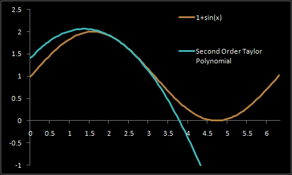

# 1. O que é uma aproximação de Taylor?

Vamos imaginar que temos uma função $f(x)$ e queremos saber **como ela se comporta perto de um ponto**, por exemplo, $x = a$.

Mas em vez de calcularmos $f(x)$ diretamente, por que isso pode ser meio complicado, vamos **aproximar** o valor de $f(x)$ quando $x$ está bem perto do ponto $a$.

A ideia do **Polinômio de Taylor** é exatamente essa:

> Aproximar a função por um polinômio que tenha a **mesma forma local** (ou seja, mesma altura, mesma inclinação, e talvez até a mesma curvatura) no ponto que queremos.

Exemplo:  

# 2. O Polinômio de Taylor de 1ª Ordem

A aproximação mais simples que temos para essa é uma **reta tangente**:

$$
f(x) \approx f(a) + f'(a)*(x-a)
$$

Essa formula quer dizer:

- Comece no valor $f(a)$;
- Vá na direção da inclinação $f'(a)$
- Multiplique pela distância $(x-a)$.

Isso nos dá a **reta tangente** no ponto $a$. Se desenhássemos o gráfico de $f(x)$ e essa reta, elas ficaram muito próximas quando perto do ponto $a$.

# 3. O Polinômio de Taylor de 2ª Ordem

Agora, e se a função **não for reta** perto do ponto $a$?  
Como por exemplo, uma parábola $x²$, que pode curvar pra cima ou pra baixo.

Daí não poderíamos usar uma reta na aproximação, por que ela não seria boa o suficiente. Precisamos de um termo pra **curvatura** da função. Esse é a **segunda derivada** $f"(a)$:

$$
f(x) \approx f(a) + f'(x) * (x-a) + {1 \over 2} f"(a)*(x-a)²
$$

Esse é o **polinômio de Taylor de 2ª Ordem.**  
Agora ele pode imitar, perto do ponto $a$:

- A **altura da função** $\to f(a)$;
- A **inclinação** $\to f'(a)$;
- A **curvatura** $\to f"(a)$.

# 4. O que significa cada parte?

| Termo         | Significado  | Intuição                             |
| :---:         | :---:        | :---:                                |
|$f(a)$         |Valor no ponto|Onde a função começa                  |
|$f'(a)*(x-a)$  |Inclinação    |Quanto a função sobe/desce linearmente|
|${1 \over 2} f"(a)*{(x-a)²}$|Curvatura|Como a função dobra (copinho pra cima ou pra baixo)|

Tem também o "resto", que é o pedaço que falta pra ficar exato as duas funções, mas ele é bem pequeno quando $x$ está perto de $a$.

# 5. Passando por várias variáveis

Agora, imagina $f(x,y)$ ou $f(x_1, x_2, \dots\ x_n)$

A ideia seria a mesma, só que em vez de inclinação e curvatura em uma linha, temos em todas as direções.

O polinômio de Taylor de 2ª ordem vira:
$$
f(\bar x + d) \approx f(\bar x) + (\nabla f(\bar x))^T d + {1 \over 2} d^T H(\bar x) d
$$

Onde:
 - $\nabla f(\bar x)$ é o **vetor gradiente** e mostra a direção da subida mais rápida.
 - $H(\bar x)$ é a **matriz Hessiana** e mostra como a função **curva em cada direção**.

E esse $d$ é o "passinho" que a gente dá apartir do ponto $\bar x$.