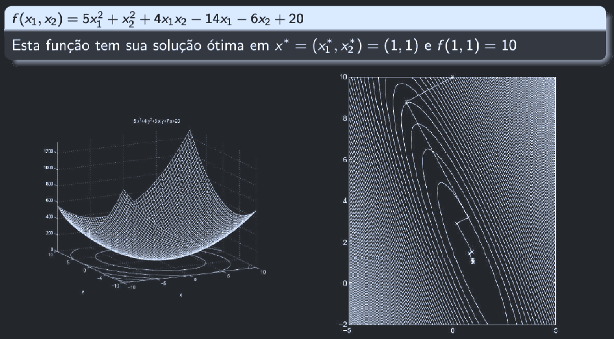

# O Problema

Vamos supor que queremos minimizar a função $f(x)$, sendo que $x \in \reals^n$:
$$
\tag{1} \min\limits_x f(x), x \in \reals^n
$$
Isso quer dizer que a gente quer **encontrar o ponto** $x$ onde a função $f(x)$ atinge seu **menor valor possível**.

A única suposição que temos é que $f(x)$ é **diferenciável**. Ou seja, tem gradiente (não tem quinas nem buracos; é contínua).

# Aproximação linear

O que a gente pode fazer é, se a gente tá em um ponto $\bar x$, podemos tentar **prever o valor da função $f$ um pouquinho à frente**. A gente pode fazer isso usando a **aproximação de Taylor de 1ª ordem** (a versão linear):
$$
f(\bar x + d) \approx f(\bar x) + \nabla f(\bar x)^T d
$$
Onde:
 - $f(\bar x)$ é o valor atual da função; e
 - $\nabla f(\bar x)^T d$ é quanto ela muda se a gente der um passinho $d$.
	 - Esse termo é o produto interno entre o **gradiente** e o **passo**.

Se o objetivo é **minimizar** $f$, a gente quer que esse incremento $\nabla f(\bar x)^T d$ seja o **menor possível**. Ou seja, queremos andar na **direção que mais faz $f$ cair**. 

O gradiente sempre vai apontar pra **direção de maior subida**. Logo, a direção de **maior descida** é o **oposto** do gradiente.

Então, o que precisamos saber é qual é o vetor $d$ minimiza o produto interno $\nabla f(\bar x)^Td$.

# "Quão longe" ou "em que direção"?

O vetor $d$, que representa o passo que estamos dando, tem **duas coisas** embutidas nele:
 - **Direção**: Que é pra **onde** ele vai; e
 - **Magnitude**: Que é o **tamanho** do passo.

Se a gente deixar o tamanho livre, dá pra deixar $||d||$ gigante, e o produto interno $\nabla f(\bar x)^T d$ vai pro $- \infin$. O que não faz sentido, porque não queremos "pular infinitamente longe".

Então, pra comparar só a **direção**, e não o tamanho do passo, podemos impor a restrição de:
$$
||d|| = 1
$$
Ou seja, estamos comparando setas com o **mesmo comprimento**. Assim, o que muda é só a **direção**!

# Usando o produto interno

Usando a desigualdade de Cuchy-Schwarz:
$$
\nabla f(x)^Td \ge - ||\nabla f(x)|| * ||d||
$$

Como a gente definiu $||d|| = 1$, isso vira:
$$
\nabla f(x)^Td \ge - ||\nabla f(x)||
$$

E a igualdade (ou seja, o caso do "mais negativo possível") acontece quando $d$ aponta exatamente na **direção oposta do gradiente**:
$$
d = -{\nabla f(x) \over ||\nabla f(x)||}
$$

Essa é a **Direção de Maior Descida** (Steepest Descent Direction)

# Usando em um algoritmo

Agora que sabemos a melhor **direção**, o próximo passo é descobrir o **quanto andar** nessa direção.

Esse é o passo $\alpha$.

O método do gradiente descendente é simplesmente:
$$
x_{k+1} = x_k - \alpha_k \nabla f(x_k)
$$

O sinal de menos é porque andamos na **direção contrária ao gradiente**, e o $\alpha_k$ controla o **tamanho do passo** 

# Algoritmo matemático
> Obs: Em otimização, a gente usa indices superiores (⁰, ¹, ², ³...) pra indicar a **iteração** do algoritmo, não pra fazer potenciação. $:=$ é atribuição.

0.  Dado $x⁰$, faça $k := 0$;
1.  $d^k := -\nabla f(x^k)$  (direção contrária ao gradiente). Se $d^k = 0$, então pare.
2.  Solucione $min_\alpha f(x^k + \alpha d^k)$ para o tamanho do passo $\alpha^k$, talvez escolhida por uma busca linear exata ou inexata.
3.  Faça $x^{k+1} \gets x^k + \alpha^k d^k, k \gets k+1$.
4.  Vá para o passo 1.

# Pseudo código
1. Escolher $x_0, \alpha, \epsilon$;
2. **Repetir** até a convergência:
	1. Calcular gradiente: $g_k = \nabla f(x_k)$;
	2. Atualizar: $x_{k+1} = x_k - \alpha g_k$;
3. **Parar** se $||g_k|| < \epsilon$.

# Código python
```python
import numpy as np

def f(x):
	return x**2 + 2*x + 1

def grad_f(x):
	return 2*x + 2

x = 5.0
alpha = 0.1

for _ in range(20):
	x = x - alpha * grad_f(x)
	print(f"x = {x:.4f}, f(x) = {f(x):.4f}")
```

# Comportamento típico
O gráfico mostra uma função bidimensional:
$$
f(x_1, x_2) = 5x_1² + x_2² + 4x_1x_2 - 14x_1 - 6x_2 + 20
$$
É uma função convexa (como uma tigela ou bacia), e tem um único mínimo em:
$$
x^* = (1,1), \space f(1,1) = 10
$$



- O gráfico 3D (à esqueda) mostra a superfície da função, que parece uma montanha.
- O gráfico à direita mostra as **curvas de nível** (vistas de cima)

As setas brancas e o caminho mostram o **gradiente descendente em ação**:
- Cada seta é uma passo $x_{k+1} = x_k - \alpha \nabla f(x_k)$;
- O tamanho de cada seta depende do $\alpha_l$ usado naquela iteração.
