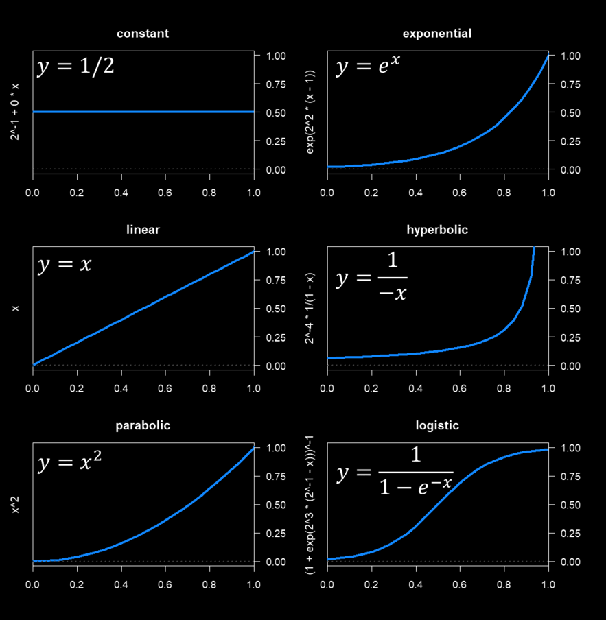
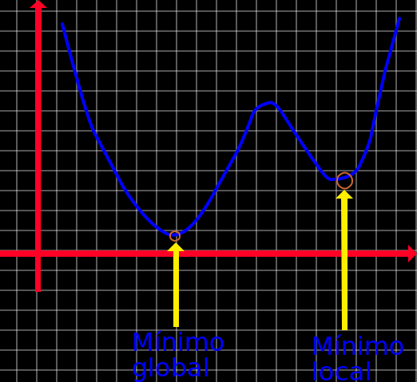

# Algoritmo de Bisseção
O primeiro algortimo que vamos ver é o algoritmo de bisseção. 

Basicamente, algoritmo de bisseção é um algoritmo de Busca Linear que tenta simplifcar o processo reduzindo o problema em uma função unidimencional, que é derivada do problema multivariável.

# Transformando o problema multivariável em unidimensional

O que a gente pode fazer é reduzir o problema de otimização de **várias dimensões** ($x$ tendo vários componentes) pra um **problema de uma única dimensão** (e uma única variável, o $\alpha$).

Ele define:
$$
h(\alpha) := f(\bar x + \alpha \bar d)
$$

Onde:
 - $\bar x$ é o ponto atual;
 - $\bar d$ é a direção escolhida (ex.: $-\nabla f(\bar x)$); e
 - $\alpha$ é o escalar que diz **o quanto** você anda nessa direção.

Então, $h(\alpha)$ representa o **valor da função** $f$ se você andar $\alpha$ unidades na direção $d$.
Agora, em vez de minizar $f(x_1, x_2, x_3...)$, a gente só precisa **minimizar uma função simples** de $\alpha$.

# Um novo problema

O novo problema que vamos encontrar no caminho é:
$$
\bar \alpha = \arg \min\limits_{\alpha} h(\alpha)
$$

Ou seja:
> "Encontre o valor de $\alpha$ que faz $h(\alpha)$ mínimo"

Que é a mesma ideia da busca linear que falamos anteriormente.

# Propriedades de $h(\alpha)$
O Slide diz:

> $h(\alpha)$ é uma função convexa na variável escalar $a$.

Isso significa que o gráfico de $h(\alpha)$ é em uma **forma de tigela (convexo)**, então tem um **único ponto mínimo**.

Esse é o ideal, o nosso $\bar \alpha$.

# Derivando $h(\alpha)$
No Slide, é dito que devemos demonstrar:
$$
h'(\alpha) = \delta f(\bar x + \alpha \bar d)^T * \bar d
$$

Vamos destrinchar essa equação: 

Pela regra de cadeia: 
 - $f(\alpha) = f(\bar x + \alpha \bar d)$
 - Logo, derivando em relação à $\alpha$:
$$
{\delta h \over \delta \alpha} = {\delta f \over \delta x} * {\delta x \over \delta \alpha} = \nabla f(\bar x + \alpha \bar d)^T \bar d
$$

Lembrando que o gradiente $\nabla f$ é o vetor de derivadas parciais, e $\bar d$ é a direção que estamos percorrendo.

O produto interno $\nabla f^T \bar d$ diz como **$f$ varia a longo dessa direção**.

# O significado de $h'(0) < 0$
A proposição diz: 
$$
h'(0) < 0
$$

Isso quer dizer:
> No ponto atual ($\alpha = 0$), a função $f$ tá **diminuindo** se eu andar na direção $d$.

Ou seja, se a derivada é negativa, o gráfico tá descendo naquele ponto.
Então, o primeiro passo na direção $d$ faz $f$ diminuir, o que faz de $d$ uma **direção de descida válida**.

# Monotocidade e convexidade
Uma função é **monotônica** quando ela **sempre cresce** ou **sempre decresce**, sem nunca "voltar atrás". Ou seja, todos os pontos da função tem que ser pelo menos igual ou maior/menor que o anterior.

Exemplos:

O Slide conclui:
> Como $h'(\alpha)$ é uma função crescente monotônica de $\alpha$

Isso vem da convexidade!
Em funções convexas, a derivada é **crescente**. Ela começa negativa (descendo), passa por zero (mínimo), e depois fica positiva (subindo): 

Então: 
- Para $\alpha < \text{ótimo}$, o $h'(\alpha) < 0 \text{ descendo}$
- Para $\alpha < \text{ótimo}$, o $h'(\alpha) > 0 \text{ subindo}$
- No mínimo, temos $h'(\alpha) = 0$.

Essa propriedade é o que permite a gente a usar **bisseção** pra achar o ponto onde $h'(\alpha) = 0$

# Como entra o algoritmo de bisseção
O **algoritmo de bisseção** é um método clássico pra resolver equações do tipo:
$$
h'(\alpha) = 0
$$

Como $h'(\alpha)$ é crescente (monotônica): 
1. Pegamos dois pontos $\alpha_1$ e $\alpha_2$, onde:
$$
h'(\alpha_1) < 0, h1(\alpha_2) > 0
$$

2. Sabemos que o zero (onde a derivada muda de sinal) está entre eles.
3. Fazemos repetidamente:
	1. Pegamos o ponto médio $\alpha_m = {(\alpha_1 + \alpha_2) \over 2}$
	2. Avaliamos $h'(\alpha_m)
	3. Dependendo do sinal, substituímos um dos extremos.
4. Continuamos até que o intervalo fique pequeno o bastante para encontrarmos o $\alpha$ ótimo.

# Em resumo: 
|Símbolo     | Significado |
| :---:      | :---:       |
|$h(\alpha) = f(\bar x \alpha \bar d)$| $f$ transformada numa função 1D|
|$h'(\alpha) = \