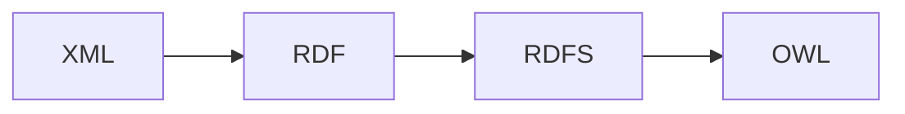

## Motivação - Por que a web atual era limitada?
## Problema central:
Os sites convencionais acabam usando o HTML para *aparência*, o CSS para *estilo* e o JS para *comportamento* dentro do seu ambiente. Mas o conteúdo só é legível (ou é mais legível) para nós humanos, já que esses foram criados para gerar estruturas legíveis para seres humanos. (Pelo menos foi assim antes da IA que lê linguagem natural kkkkk)

Exemplo de um HTML de um site de exemplo:

`

Para uma máquina, a frase "Lisa Davenport é uma terapeuta" e "Kelly Townsend é uma secretária" são só strings, sequências de caracteres. Eles não conseguem (ou pelo menos não conseguiam) ler e descobrir o significado como nós. Um exemplo seria o do Jaguar da aula passada, onde um motor de buscas pode acabar retornando resultados misturados, entre o animal, o logotipo e o carro. 

Sem **contexto semântico**, o computador não consegue distinguir os significados do mesmo termo (também chamados de **homônimos**).

### As três limitações fundamentais:
- Encontrar informações **relevantes**;
- Extrair informação **relevante**; e
- **Combinar** e **reutilizar** informações entre sites.

# O que é a "Web Semântica"?
> "A Web Semântica é uma extensão da web atual, na qual a informação recebe um **significado bem definido**, permitindo que computadores e pessoas trabalhem em cooperação" - Tim Berners-Lee, 2001

Basicamente, é uma camada que adicionamos sobre a web antiga, de forma a facilitar a leitura de informação por computadores, deixando mais explícitos e estruturados.

## Os três princípios de projeto:
- Disponibilizar dados estruturados em **formatos padronizados**;
- Tornar cada elemento de dado e suas relações **acessíveis individualmente**; e
- Descrever a **semântica pretendida** de forma que máquinas possam processá-la;

| **WEB ANTIGA** | **WEB SEMÂNTICA** |
| :---: | :---: |
| Conteúdo para **humanos**; máquinas enxergam *estrutura* (HTML), mas não o *significado*. | Conteúdo anotado com **metadados**; máquinas entendem o *significado* dos dados. |

# Tecnologias-chave
As principais tecnologias que auxiliaram essa mudança de *web antiga* para *web semântica*, foram: XML, RDF, RDFS, e OWL, nessa ordem de complexidade e implementação.



Elaborando mais sobre essas tecnologias:

## - XML: estrutura, não significado.
O **XML** permite descrever a **estrutura** da informação, mas não necessariamente o seu *significado semântico*. É basicamente um *Markup Language.

Por exemplo:

```XML
<staff>
	<therapist>Lisa Davenport</therapist>
	<secretary>Kelly Townsend</secretary>
</staff>
```

Percebe-se que essa estrutura já deixa claro que *Lisa Davenport* e *Kelly Townsend* são ambas parte de *staff*, ou seja, da classe de funcionários. Também deixa explícito que são de duas funções diferentes.
