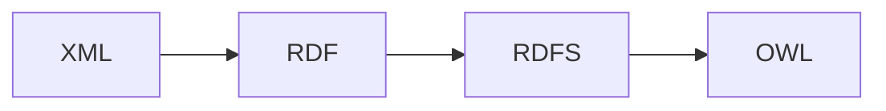
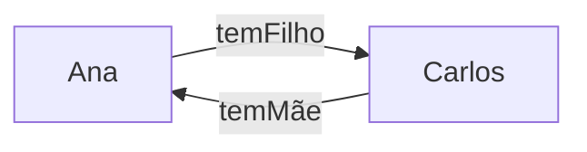

## Motivação - Por que a web antiga era limitada?
## Problema central:
Os sites convencionais usavam o HTML para *aparência*, o CSS para *estilo* e o JS para *comportamento* dentro do seu ambiente. Mas o conteúdo só é legível (ou é mais legível) para nós humanos, já que esses foram criados para gerar estruturas legíveis para seres humanos. (Pelo menos foi assim antes da IA que lê linguagem natural kkkkk)

Exemplo de um HTML de um site de exemplo:

```HTML
<h1>Agilitas Physiotherapy Centre</h1>

Welcome to the Agilitas Physiotherapy Centre home page.
Do you feel pain? Have you had an injury? Let our staff
Lisa Davenport, Kelly Townsend (our lovely secretary)
and Steve Matthews take care of your body and soul.

<h2>Consultation hours</h2>
Mon 11am - 7pm<br>
Tue 11am - 7pm<br>
Wed 3pm - 7pm<br>
Thu 11am - 7pm<br>
Fri 11am - 3pm<p>
	
But note that we do not offer consultation during the weeks of the
	<a href=¨ . . .¨>State of Origin</a> games.
```

Para uma máquina, seria difícil diferenciar as pessoas no exemplo acima. A frase "Lisa Davenport é uma terapeuta" e "Kelly Townsend é uma secretária" são só strings, sequências de caracteres. Eles não conseguem (ou pelo menos não conseguiam) ler e descobrir o significado como nós. 

Um exemplo seria o do Jaguar da aula passada, onde um motor de buscas pode acabar retornando resultados misturados, entre o animal, o logotipo e o carro. 

Sem **contexto semântico**, o computador não consegue distinguir os significados do mesmo termo (também chamados de **homônimos**).

### As três limitações fundamentais:
- Encontrar informações **relevantes**;
- Extrair informação **relevante**; e
- **Combinar** e **reutilizar** informações entre sites.

# O que é a "Web Semântica"?
> "A Web Semântica é uma extensão da web atual, na qual a informação recebe um **significado bem definido**, permitindo que computadores e pessoas trabalhem em cooperação" - Tim Berners-Lee, 2001

Basicamente, é uma camada que adicionamos sobre a web antiga, de forma a facilitar a leitura de informação por computadores, deixando mais explícitos e estruturados.

## Os três princípios de projeto:
- Disponibilizar dados estruturados em **formatos padronizados**;
- Tornar cada elemento de dado e suas relações **acessíveis individualmente**; e
- Descrever a **semântica pretendida** de forma que máquinas possam processá-la;

| **WEB ANTIGA** | **WEB SEMÂNTICA** |
| :---: | :---: |
| Conteúdo para **humanos**; máquinas enxergam *estrutura* (HTML), mas não o *significado*. | Conteúdo anotado com **metadados**; máquinas entendem o *significado* dos dados. |

# Tecnologias-chave
As principais tecnologias que auxiliaram essa mudança de *web antiga* para *web semântica*, foram: XML, RDF, RDFS, e OWL, nessa ordem de complexidade e implementação.



Elaborando mais sobre essas tecnologias:

## - XML: estrutura, não significado.
O **XML**, ou E**X**tensible **M**arkup **L**anguage, permite descrever a **estrutura** da informação, mas não necessariamente o seu *significado semântico*. Como o nome diz é basicamente uma *Markup Language*.

Exemplo:

```XML
<staff>
	<therapist>Lisa Davenport</therapist>
	<secretary>Kelly Townsend</secretary>
</staff>
```

Percebe-se que essa estrutura já deixa claro que *Lisa Davenport* e *Kelly Townsend* são ambas parte de *staff*, ou seja, da classe de funcionários. Também deixa explícito que são de duas funções diferentes. Isso já melhora bem para o entendimento de uma máquina quando comparado ao site de exemplo no início desse documento.

## RDF: Triplas de sujeito, predicado e objeto
O **RDF**, ou **R**esource **D**escription **F**ramework,  é uma linguagem básica da *Web Semântica*. Ela faz afirmações sobre recursos usando grafos de triplas identificadas por URIs (Uniform Resource Identifier).

Exemplo:

```RDF
CompanyA rdf:type Physiotherapy
Lisa rdf:type Therapist
Lisa worksFor CompanyA
```

## RDFS: Vocabulário e hierarquia de tipos
O **RDFS** ou **RDF Schema** é uma construção em cima do RDF, criada para adicionar *classes, subclasses e propriedades* ao RDF. Ela permite fazer **inferências simples**, como **herança**.

Exemplo:

```RDFS
<#Student, rdfs:subClassOf, #Person>
<#hasName, rdfs:domain, #Person>
<#hasName, rdfs:range, xsd:string>
```

No exemplo acima, o código descreve que há uma classe *Student* que é filha da classe *Person (e logo herda seus atributos). Também descreve que a propriedade *hasName* é exclusiva do domínio do tipo *Person*, e que *hasName* é do tipo *String* (Não números ou outros tipos).

## OWL: Ontologias ricas e raciocínio avançado
O **OWL**, ou **O**tology **W**eb **L**anguage, é uma evolução sobre o RDFS, superando suas limitações e permitindo:
- Disjunção;
- Cardinalidade;
- Propriedades inversas;
- Equivalência de classes;
- Restrições locais;
- Consistência;
- etc.

### 1. Disjunção:
Declara que duas classes *não podem ter membros em comum*. Nenhum indivíduo pode pertencer à duas classes *ao mesmo tempo*.

Por exemplo, não seria possível um `animal` ser `carnívoro` e `herbívoro`, ou uma pessoa ser `homem` e `mulher` ao mesmo tempo:
```OWL
:Carnívoro owl:disjointWith :Herbívoro .
:Homem owl:disjointWith :Mulher .

:Ana rdf:type :Mulher
:Ana rdf:type :Homem ❌️
```

### 2. Cardinalidade:
Restringe quantas vezes uma propriedade pode ser usada por indivíduos de uma classe. Permite restringir relacionamentos para *"exatamente 1", "no mínimo 2", "no máximo 5"*, etc.

Por exemplo, uma `pessoa` só pode ter *exatamente 1* `data_de_nascimento`. Um time de futebol tem *exatamente 11* jogadores em campo, um carro tem *no mínimo 3 e no máximo 5* portas, etc.

Exemplo:
```OWL
:Pessoa rdfs:subClass of [
	rdf:type owl:Restriction ;
	owl:onProperty :temNome ;
	owl:cadinality "1"^^xsd:nonNegativeInteger
] .

\\ Toda *Pessoa* tem exatamente 1 nome.
```

### 3. Propriedades inversas:
Se a propriedade $P$ relaciona $A \rarr B$, a propriedade inversa $Q$ automaticamente relaciona $B \rarr A$. Isso elimina a redundância e permite a **inferência automática** da relação oposta.

Por exemplo, Se *"Ana temFilho Carlos"* é verdade, então automaticamente *"Carlos temPai/Mãe Ana"* também é verdade, *sem precisar declarar explicitamente*.



```owl
:temFilho owl:inverseOf :temPai .

Declarado -> :Ana    :temFilho :Carlos .
Inferido  -> :Carlos :temPai   :Ana .

// O racionador infere a tripla inversa automaticamente,
// sem nenhuma declaração extra.
```

### 4. Equivalência de classes
Declara que duas classes descrevem exatamente o mesmo conjunto de indivíduos, mesmo que venham de ontologias **diferentes**. Ela é fundamental para a integração de **dados heterogêneos**.

Por exemplo: A ontologia da USP chama de `:Docente` o que a ontologia do MEC chama de `:Professor`. Ao declarar essa equivalência, as instâncias de uma ficam disponíveis na outra **automaticamente**.

```owl
ont-usp:Docente owl:equivalentClass ont-mec:Professor .

Declarado em ont-usp -> :João rdf:type ont-usp:Docente .
Inferido 			 -> :João rdf:type ont-mec:Professor .

// Isso é diferente de rdfs:subClassOf (unidirecional). 
// Essa é bidirecional: 
// Todo membro de A é membro de B, e vice-versa.
```

### 5. Restrições locais de alcance
RDFS só permite alcance global de uma propriedade. O OWL permite restringir o alcance *localmente* para uma **classe específica**. Isso evita que restrições de um domínio "contaminem" toda a ontologia.

Por exemplo: Se `temNome rdfs:range xsd:string`, isso vale pra *todos* que usam `temNome`, inclusive classes que deveriam ter objetos como nome. Com o OWL, podemos fazer "Para Classe `:Pesssoa`, a propriedade `:temNome` tem o alcance de `xsd:string`" sem precisar afetar as outras classes.

```owl
owl:allValuesFrom :Humano  // Todo valor é Humano
owl:someValuesFrom :Humano // Existe ao menos 1 Humano

:VôoComercial rdfs:subClassOf [
	rdf:type owl:Restriction ;
	owl:onProperty :temPiloto ;
	owl:allValuesFrom :PilotoComercial 
] .

// Todo piloto de VôoComercial deve ser PilotoComercial
// A retrição é local, não afeta :VôoParticular
```

### 6. Consistência:
Verificação automática para ver se a ontologia (classes + axiomas + instâncias) é logicamente coerente. Ou seja, se **não tem contradições** que o tornem uma classe "unsatisfiable" (impossível de ter membros).

Uma inconsistência ocorre quando axiomas combinados produzem uma **contradição lógica**. Um indivíduo forçado a pertencer a classes disjuntas, ou a violar uma restrição de cardinalidade.

Por exemplo:

#### Cenário 1:
```owl
:Homem owl:disjointWith :Mulher
:Pedro rdf:type :Homem .
:Pedro rdf:type :Mulher ❌️ 

// Inconsistência: Não é possível ser :Homem e :Mulher ao mesmo tempo
```

#### Cenário 2:
```owl
:EstudanteDesempregado owl:equivalentClass [
	owl.intersectionOf (:Estudante :Empregado)
] .

:Estudante owl:disjointWith :Empregado . 

\\ Agora :EstudanteDesempregado é UNSATIFIABLE,
\\ Já que nenhum indivíduo pode existir nessa classe
```

Relacionadores OWL (HermiT, Pellet) verificam consistência automaticamente e apontam qual axioma gerou a contradição, facilitando a depuração.

---

