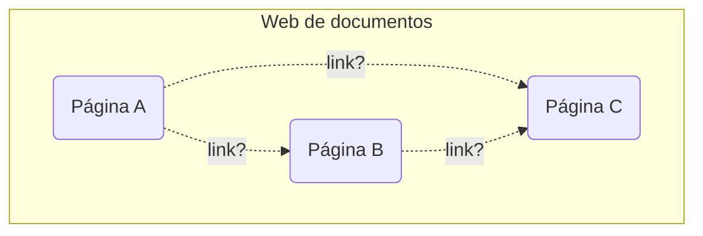
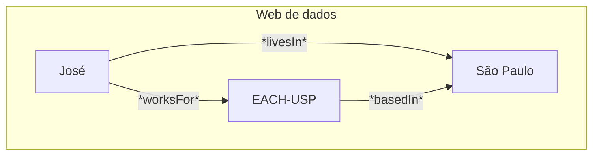

# Linha do tempo
De onde viemos até os Grafos de Conhecimento:
- **1945** - Memex, o precursor de tudo.
	- **Vannevar Bush** imaginou o Memex: uma máquina que daria acessos a grande coleções de texto via trilhas de links e anotações, não dissemelhante à internet moderna e seus hiperlinks. Nunca foi construido, mas plantou a semente do hipertexto.
- **1965** - Primeiras conexões:
	- **Ted Nelson** pensou em uma organização de objetos de forma altamente conectada. Elementos: **nós** (pedaços de texto) + **hiperlinks** (conexões lógicas entre nós). Na época, foi conceptualizado com apenas texto, sem multimídia.
- **1980s** - Hipermídia:
	- Na década de 1980, começa-se a pensar em uma evolução do hipertexto: com recursos multimídia (imagens, vídeo, audio, etc.) que passam a fazer parte da estrutura ligada de nós. Ainda não tem a semântica.
- **1990** - Hipermídia posta em prática:
	- **Tim Berners-Lee** conceptualiza um sistema de hipermídia exemplar, proposto no CERN (Sim, aquele CERN mesmo, do acelerador de partículas, que é só mais um dos seus projetos relacionados a pesquisa nuclear). Combina **URI** (Identidade) + **HTTP** (comunicação) + **HTML** (representação). Os links entre documentos não são tipados, a máquina *não sabe* por que A aponta para B.
- **2001** - :
	- **Berners-Lee**, **Hendler** e **Lassila** pensam em uma visão "top-down", "de cima para baixo": anotar o conteúdo existente com significado formal via ontologias (OWL, RDFS). Foco em *raciocínio automático*. Grandes resultados em medicina/biologia (Gene Ontology, SNOMED CT, etc.). Mas criar ontologias é caro e complexo demais.
- **2006** - Dados Ligados (Linked Data):
	- Pensam em uma bordagem "bottom-up", "de baixo para cima": publicar dados estruturados usando URIs + RDF + HTTP, ligando conjuntos de dados entre si. Ênfase na *interoperabilidade*, não necessariamente na *riqueza ontológica*. Muito mais fácil e barato de aplicar em larga escala.
- **2012** - Grafos de Conhecimento e Google:
	- Em 2012, a Google populariza o termo com o seu *Knowledge Graphs* baseado no [schema.org](schema.org). Diferença principal: GCs são *internamente consistentes e controlados* (indústria). Eles não são abertos como o projeto da LOD Cloud. A Microsoft, IBM, Facebook e eBay adotam o conceito. Ele também tem forte ligação com os conceitos de Machine Learning e Deep Learning.
- **Hoje** - Convergência da Web Semântica com Linked Data e GC:
	- Hoje os três pilares convivem: **Ontologias** servem para fornecer o *vocabulário formal*; **Linked data** serve para publicar e conectar os dados; Enquanto **Grafos de Conhecimento** estruturam o conhecimento para aplicações industriais e de IA.

# A virada central
A web que hoje nós conhecemos é uma **web de documentos**: HTML é usado para fazer a sua *estrutura visual*, HTTP é usado para *comunicação* e URI é usado para fazer o *endereçamento*. Os *hiperlinks* ligam as páginas, mas não dizem o **porquê**. A máquina não sabe se o link é "é autor de", "trabalha em" ou "contradiz" o conteúdo! Isso é problema dos enlaces (ou ligações) não tipados.

A Web de Dados se propõe a resolver isso trocando os *documentos* por *coisas*, e *hiperlinks genéricos* por *enlaces tipados em RDF*. 






# Os 4 princípios de Dados Ligados
Os **Dados Ligados** têm uma filosofia bem concreta. Berners-Lee enunciou os 4 princípios em 2006.

**1. Usar URIs como nomes para coisas**
	Qualquer coisa, como pessoas, cidade, eventos ou ideias, deve ter uma URI, não apenas documentos. Você não é sua página de HTML, né? Por exemplo: `http://dbpedia.org/resource/sao_paulo`

**2. Usar HTTP URIs**
	As URIs do tipo `http://` permitem que qualquer pessoa localize e resolva o recurso pela web mesmo, garantindo unicidade global com *propriedade distribuída*. Por exemplo: `http://tomheath/id/me`

**3. Fornecer informação útil em RDF**
	Quando alguém acessa a URI, deve receber dados estruturados em RDF que descrevem o recurso, não apenas uma página HTML para humanos. Por exemplo: `<:Jose> :worksFor <:EACH-USP>`

**4. Incluir enlaces RDF para outros URIs**
	Os dados tem que apontar para URIs externas, permitindo que os agentes descubram unformações relacionadas em outros conjunto de dados. Isso é propósito de uma Rede de Dados. Por exemplo: `owl:sameAs, rdfs:seeAlso`

# 5 estrelas do LOD
Logo depois, Berners-Lee também criou o **modelo de 5 estrelas** para avaliar o quão bem publicado está um dado.

**★ - Disponível com licença aberta**
O dado está disponível na web com **licença aberta**, em qualquer formato. Por exemplo: `PDF`, `DOC`, `JPG`.

**★★ - Dado estruturado, legível por máquina**
O dado *pode ser processado por um software*. Mas ainda pode ser em **formato proprietário**. Por exemplo: `XLS`, `XLSX`.

**★★★ - Formato não-proprietário**
O mesmo dado agora está em um **formato aberto**, sem necessidade de software específico para ser lido. Por exemplo: `CSV`, `TSV`.

**★★★★ - Usa URIs para identificar coisas**
Cada item do dado tem uma URI permanente, seguindo os padrões da W3C. Um terceiro pode apontar e referenciar os seus dados. Por exemplo: `RDF`, `Turtle`.

**★★★★★ - Liga seus dados à outros dados**
O conjunto de dados contém links RDF apontando para URIs externas, criando telas de dados interligados. O objetivo final do LOD. Por exemplo: `RDF + owl:sameAs`, [LOD Cloud](https://lod-cloud.net/).

# SPARQL - O SQL da Web de Dados
**SPARQL** é uma linguagem de consulta para grafos RDF. Do mesmo jeito como SQL é usado para consultas de tabelas relacionais, o SPARQL é usado para conusltas de triplas. 

## SQL vs SPARQL

**SQL:**
```SQL
SELECT nome, cargo
FROM funcionarios
WHERE departamento = 'TI'
```

**SPARQL:**
```SPARQL
SELECT ?nome ?cargo
WHERE {
	?p :nome ?nome ;
	   :cargo ?cargo ;
	   :dept :TI .
}
```

## Estrutura base de uma consulta em SPARQL
```SPARQL
PREFIX ex: <http://exemplo.org/> # atalhos de namespace
PREFIX rdf: <http://www.w3.org/1999/02/22-rdf-syntax-ns#>

SELECT ?pessoa ?local # o que se quer retornar
FROM <http://meu-grafo.org/> # de qual grafo (opcional)
WHERE {
	?pessoa ex:worksFor ex:EACH-USP .
	?pessoa ex:livesIn ?local .
}
```

## Exemplo real - Consultando a DBpedia
```SPARQL
PREFIX dbo: <http://dbpedia.org/ontology/>
PREFIX dbr: <http://depedia.org/resource/>

SELECT ?nome ?nascimento
WHERE {
	?pessoa dbo:birthPlace dbt:Sao_Paulo .
	?pessoa dbo:birthDate ?nascimento .
	?pessoa foaf:name ?nome .
}
LIMIT 10
```

Resultados simulados:
```SPARQL
?nome       "Ayrton Senna"
?nascimento "1960-03-21"^^xsd:date
?nome       "Pelé"
?nascimento "1940-10-23"^^xsd:date
```

## Outros recursos

[Teste real - DBpedia](https://dbpedia.org/sparql)
[Tutorial - Apache Jena](https://jena.apache.org/tutorials/sparql.html)

# Web Semântica vs Linked Data vs Grafos de Conhecimento
| Abordagem | Visão | Foco | Origem | Limitação | Resultado notável | Outras palavras chave |
| --- | --- | --- | --- | --- | --- | --- |
| **Web Semântica** | *Top-down*: define ontologias formais primeiro, e depois anota os dados | *Raciocínio automático* e inferência via OWL/RDFS | Academia / W3C | Construir ontologias é caro e complexo. Alta barreira de adoção | Gene Ontology, SNOMED CT, etc. | `OWL`, `RDFS`, Raciocínio |
| **Linked Data** | *Bottom-up*: publica em qualquer dado estruturado com URI + RDF + HTTP | Interoperabilidade e publicação em *larga escala*, não na *riqueza ontológica*. | W3C, movimento Open Data | LOD Cloud é fragmentada, subgrafos com esquemas heterogêneos, fracamente interligados | DBpedia, Wikidata, GeoNames, etc. | `URI`, `RDF`, `HTTP`, Openness |
| **Grafos de Conhecimento** | Artefato internamente consistente e controlado para *aplicações industriais*. | Qualidade, coerência interna e integração com ML/NLP. | Indústria, Google, etc. | Não são verdadeiramente abertos, são liderados pela indústria com objetivos comerciais | Google KG, Microsoft KG, Wikidata (híbridop), eBay Prodcut Graph | schema.org, ML, NLP, Neo4J |

Outra novidade relevante é o conceito de URL → URI → IRI: URL identifica o que existe na web; URI identifica qualquer coisa pela web; IRI generaliza para qualquer idioma/caractere (internacionalização).


.
.
.
.
.
.
.
.
.
.
.
.
.
.
.
.
.
.
.