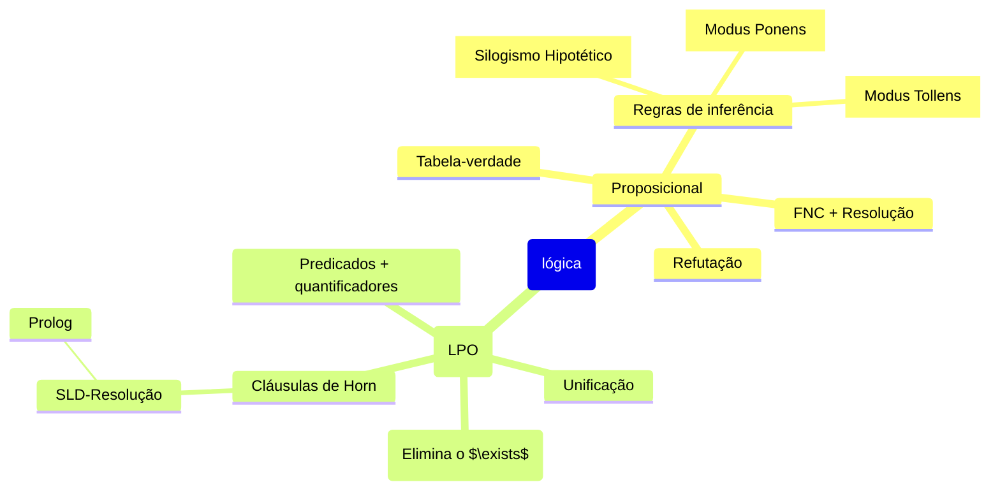

# 1. Lógica proposicional

A lógica é um formalismo para eliminar a ambiguidade da linguagem natural. Porque precisamos disso? Não podemos contruir um argumento sólido e+m um solo arenoso e macio.

Um **argumento** tem premissas e uma conclusão, e é válido quando a conclusão segue necessariamente das premissas.

Na **lógica proposicional**, trabalhamos com proposições (duh), esses as quas são definidas como declarações que são verdadeiras ou falsas, e são concectadas por:

| Símbolo| Significado |
| --- | --- |
| $\neg$ | Não |
| $\land$ | E |
| $\lor$ | Ou |
| $\to$ | Então / Implica em |

Supomos que temos uma frase em linguagem natural que queremos formalizar:
> "Se o técnico é bom, o time joga bem. Se o time joga bem, ganha o campeonato. Se ganha, os torcedores ficam contentes. Os torcedores não estão contentes. Logo, o técnico não foi bom."

$$
\begin{array}{lcll}
(1) & p \to q & - & \text{time joga bem} \to \text{time ganha} \\
(2) & \neg p \to r & - & \text {time não joga bem} \to \text{técnico ruim} \\
(3) & q \to s & - & \text{time ganha} \to \text{torcedores ficam contentes} \\
(4) & \neg s & - & \text{torcedores não estão contentes} \\
(5) & \therefore r &-& \text{Logo, o técnico é ruim.}
\end{array}
$$

# 2. Tabelas - Verdade e Validade

Para verificar se um argumento é válido, contrói-se uma tabela-verdade. Uma fórmula pode ser:

- **Tautologia**: verdadeira em todas as interpretações;
- **Contraditória**: falsa em todas;
- **Statisfazível**: veradeira em pelo menos uma.

Um argumento $\{\alpha_1, \alpha_2, \dots, \alpha_n\} \models \beta$ é válido se $(\alpha_1 \land \alpha_2 \land \dots \land \alpha_n) \to \beta$ for uma **tautologia**.

> Obs: Para problermas com $n$ símbolos, a tabela teria $2^n$ linhas, o que seria inviável para fórmulas grandes.

# 3. Regras de Inferência

Essa é a alteranativa mais eficiênte às tabelas-verdade. 
As três regras clássicas são:

| Regra | Forma | Exemplo |
| --- | --- | --- |
| **Modus Ponens (MP)** | $\alpha \to \beta$ , $\alpha \vdash \beta$| "Se chove, molha. Choveu; logo, molhou."|
| **Modus Tollens (MT)** | $\alpha \to \beta$, $\neg \beta \vdash \neg \alpha$ | "Se chove $\to$ molha. Não molhou; logo, não choveu" |
| **Silogismop Hipotético (SH)** | $\alpha \to \beta$, $\beta \to \gamma \vdash \alpha \to \gamma$ | "Se chove, molha. Se molha, plantas crescem. Logo: se chove, plantas crescem" |

Prova do exemplo do time, usando as três regras:
$$
\begin{array}{lllll}

(5) & p \to s & \text{SH}(1,3) & - & \text{time joga bem} \to \text{torcedores contentes} \\

(6) & \neg s \to \neg p & \text{MP}(4,5) &-& \text{torcedores não contentes} \to \text{time não jogou bem} \\

(7) & \neg p \to r & \text{MP}(2,6) &-& \text{time não jogou bem} \to \text{técnico ruim}

\end{array}
$$

# 4. Refutação

Provar que $BC \vdash \gamma$ é verdadeiro é mostrar que $BC ~ \cup ~ \{\neg \gamma\}$ é inconsistente. Ou seja. a hipótese contrária leva a uma contradição lógica.

Por exemplo, para provar que "o técnico é ruim", assume-se "o técnico não é ruim" e deriva-se uma contradição a partir disso:
$$
\begin{array}{lcllll}
(a) & \neg r & - & \text{técnico não é ruim} & \larr & \text{hipótese} \\
(b) & \neg r \to p &-& \text{time jogou bem} & \larr & \text{MT}(a, P2) \\
(c) & q & - & \text{time ganhou} & \larr & \text{MP}(b, P1) \\
(d) & s & - & \text{torcedores contentes} & \larr & \text{MP}(c, P3) \\
(d) & ! & - & \text{torcedores não contentes} & \larr & \text{Contradição: confronta P4} \\
\end{array}
$$

# 5. Forma Normal Conjuntiva (FNC) e Resolução

Para automatizar a refutação, converte-se tudo para **FNC** (conjunto de disjunções):
1. Eliminar implicações: $\alpha \to \beta \equiv \neg \alpha ~\land~ \beta$;
2. Reduzir o escopo das negações (De Morgan);
3. Distribuir disjunções sobre conjunções.

A resolução é aregra de inferência que generaliza as três clássicas:
$$
\text{RES}(\alpha \lor \beta, \neg \beta \lor \gamma) = \alpha \land \gamma
$$

A prova do exemplo do time em FNC + resolução + refutação fica:
$$
\begin{array}{lclllll}
(1) & \neg p \lor q \\
(2) & p \lor r \\
(3) & \neg q \lor s \\
(4) & \neg s \\
(5) & \neg r & \larr & \text{Hipótese} \\
(6) & p & \larr & \text{Res.}(2,5) \\
(7) & q & \larr & \text{Res.}(1,6) \\
(8) & s & \larr & \text{Res.}(3,7) \\
(9) & \bot (\neg r \ne r) & \larr & \text{Res.}(4,8) \rarr \text{Contradição}(\bot)
\end{array}
$$

# 6. Lógica de Primeira Ordem (LPO)

A lógica proposicional não consegue expressar "todo homem é mortal". Para isso, a LPO adiciona:
- Predicados: $\text{homem}(\text{socrates}), \text{mortal}(x)$;
- Quantificador universal $\forall x [\text{homem} (x) \to \text{mortal}(x)]$;
- Quatificador existencial: $\exists x[\text{planta}(x) \land \text{carnivora}(x)$.

Os 4 tipos de enunciados categórios são:
| Tipo | Forma | Exemplo |
| --- | --- | --- |
| **Universal afirmativo** | $\forall x[~p(x) \to q(x)~]$ | "Todo homem é mortal"* |
| **Universal negativo** | $\forall x [~p(x) \to \neg q (x)~]$ | *"Nenhum leão é manso"* |
| **Particular afirmativo** | $\exists x [~ p(x) \land q(x) ~]$ | *"Alguns políticos são honestos"* |
| **Particular negativo** | $\exists x [~ p(x) \land \neg q(x) ~]$ | *"Alguns políticos não são honestos"*

# 7. Skolemização e Unificação
**Skolemização** elimina variáveis existenciais, substituindo-as por funções:

$\forall x [ \text{mestre}(x) \to \exists y [\text{discipulo}(y, x)]]$
vira:
$\forall x[ \text{mestre}(x) \to \text{discipulo}(\text{seguidor}(x), x)]$

**Unificação** determina as substituições necessárias para tornar duas fórmualr idênticas:
$\text{gosta}(\text{ana}, x)$ unifica com $\text{gosta}(y, z)$ fazendo $y=\text{ana}$ e $x=z$.

Isso permite aplicar resolução na LPO:

$\text{homem}(\text{socrates})$
$\neg \text{homem}(X) \land \text{mortal}(x) \qquad \larr \text{com } x = \text{socrates}$
$\text{------------------------------}$
$\text{mortal}(\text{socrates}) \quad \checkmark$

# 8. Cláusulas de Horn e SLD-Resolução

Cláusulas de Horn tem a forma $[\phi \larr \phi_1, ..., \phi_n]$ (no máximo uma conclusão). São a base do Prolog.

Tipos:
- Fato: $\text{pai}(\text{adão}, \text{abel}) \larr$
- Regra: $\text{avô}(x, z) \to \text{pai}(x,y),~ \text{pai}(y,z)$
- Consulta: $\larr \text{saudável}(R)$

O algoritmo SLD-resolução faz busca em profundidade para responder consultas, podendo termnar em **sucesso** (contradição encontrada = resposta confirmada) ou em **fracasso** (nenhum caminho funciona).

Exemplo de "O que é saudável?":
```
bebe(zé, pinga);
bebe(mané, água);
vivo(mané);
saudável(x) :- bebe(y, x), vivo(y)
```

Consulta `?- saudável(R)` $\to$ tenta `zé` (falha, pois `zé` não é `vivo`) $\to$ tenta `mané`, (sucesso: `R = água`) $\checkmark$

# 9. Negação por Falha Finita

É baseada na **hipótese do mundo fechado**: *tudo que é verdadeiro está declarado.* Se não consegue provar $\gamma$, assume-se $\neg \gamma$.

```
voa(x) :- ave(x), not (pinguim(x)).
```
> `fred` é ave, mas pinguem $\to$ `voa(fred)`  falha. `bob` é ave mas **não** é pinguim $\to$ `voa(bob)` é sucesso $\checkmark$


# 10. Mapa Mental



.
.
.
.
.
.
.
.
.
.
.
.
.
.
.
.
.