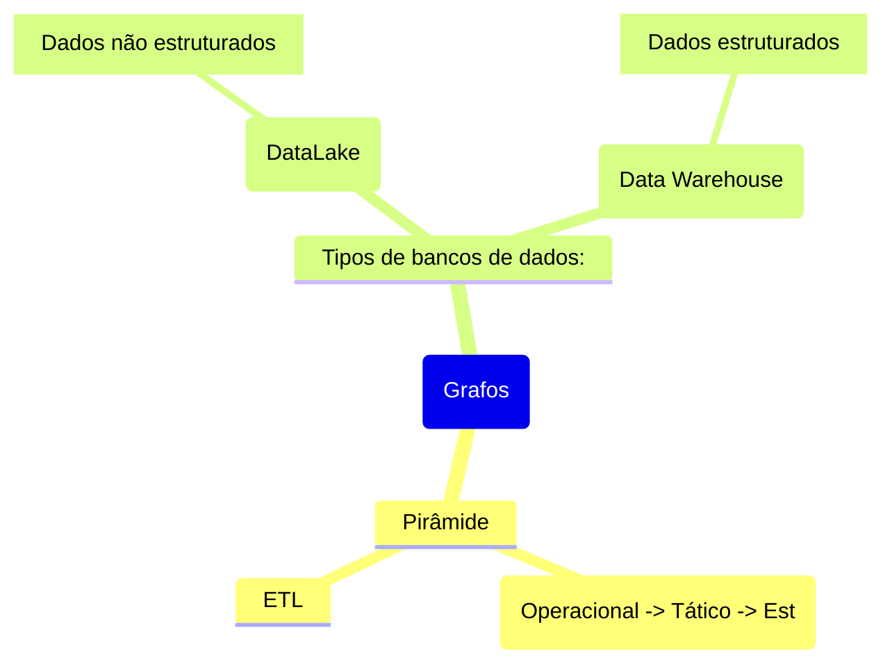

```mermaid
mindmap
	Root(Grafos)
		Pirâmide
			("Operacional -> Tático -> Est")
			ETL

		Tipos de bancos de dados:		
			(DataLake)
				[Dados não estruturados]
			(Data Warehouse)
				[Dados estruturados]

		
```
