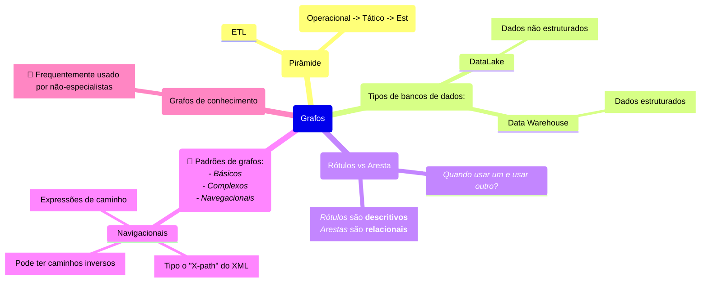
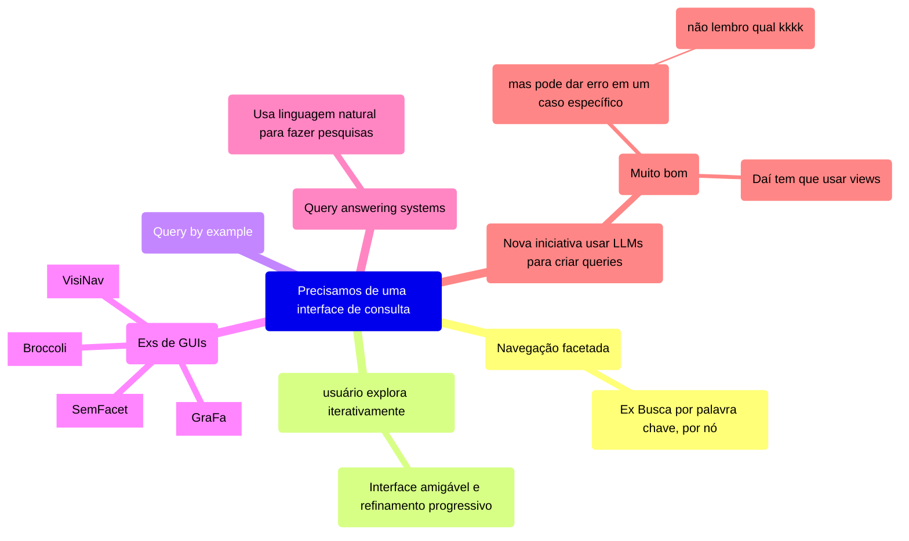

```mermaid
mindmap
Root(Grafos)
	(Pirâmide)
		("Operacional -> Tático -> Est")
		ETL

	(Tipos de bancos de dados:)		
		DataLake
			[Dados não estruturados]
		Data Warehouse
			[Dados estruturados]

	(Rótulos vs Aresta)
		*Quando usar um e usar outro?*
		[*Rótulos* são **descritivos**
		*Arestas* são **relacionais**]

	(🔑 Padrões de grafos:
	*- Básicos*
	*- Complexos*
	*- Navegacionais*)
		
		Navigacionais
			[Tipo o "X-path" do XML]
			["Expressões de caminho"]
			[Pode ter caminhos inversos]

	(Grafos de conhecimento)
		[🤔 Frequentemente usado por não-especialistas]
		

			
```

(Grafos de conhecimento)
🤔 Frequentemente usado por não-especialistas


```mermaid
mindmap
	root(Precisamos de uma interface de consulta)
		(Navegação facetada)
			(Ex Busca por palavra chave, por nó)
		(usuário explora iterativamente) 
			(Interface amigável e refinamento progressivo)
		(Query by example)
		(Exs de GUIs)
			[Broccoli]
			[VisiNav]
			[SemFacet]
			[GraFa]
		(Query answering systems)
			(Usa linguagem natural para fazer pesquisas)
		(Nova iniciativa usar LLMs para criar queries)
			(Muito bom)
				(mas pode dar erro em um caso específico)
					(não lembro qual kkkk)
				(Daí tem que usar views)

```


Parte 2:

```mermaid

``