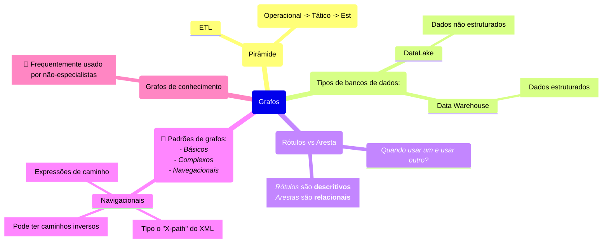
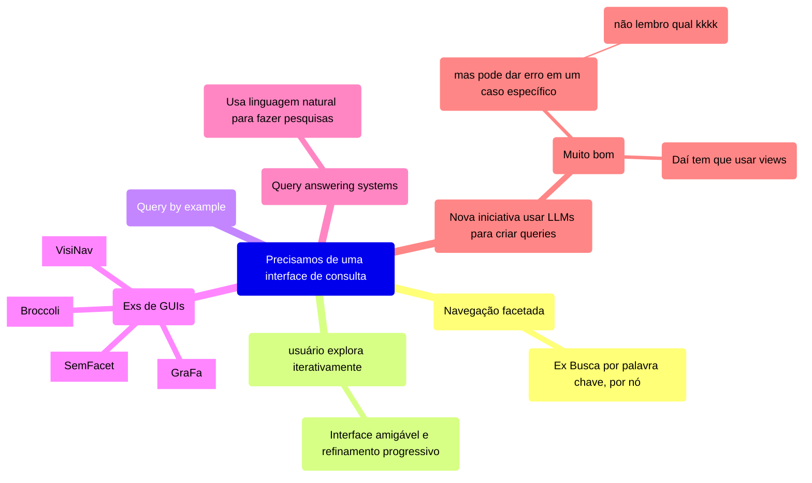
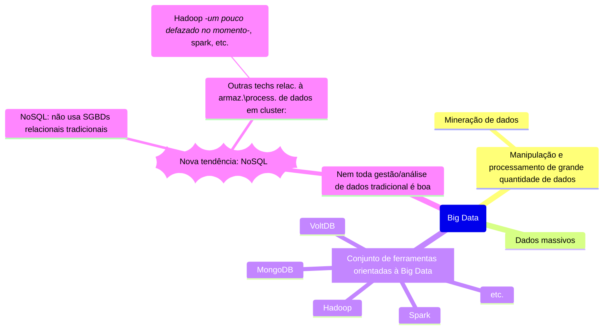

# Parte 1: Grafos

(Grafos de conhecimento)
🤔 Frequentemente usado por não-especialistas

# Parte 2: Tecnologia de Big Data

NoSQL não significa que é SQL, só que não é relacional.

Precisamos de profissionais que lidam com grande volume de dados.

Analisar dados sempre existiu, mas agora temos demandas para especialistas (como engenheiro de dados, analista de dados, engenheiro de ML, etc.)

**Hadoop** é baseado em *MapReduce*. Apesar ser muito bom para simplificar, nem tudo pode ser solucionado com essa abordagem. *Map Reduce: Mapeia e reduz, agregando resultados.*

## Cientista de dados x Engenheiro de dados
- **Cientista de dados**:
	- Trabalha com a **descoberta de conhecimento** usando a análise de dados.
	- Utilizam técnicas matemáticas e algoritmos para solucionar problemas de negócio.
- **Engenheiro de dados**:
	- Trabalha para processar e tratar dados pra serem usados em aplicações de Big Data.
	- Utilizam conhecimento de ciência da computação p/ criar sistemas e resolver problemas de processamento de dados em **tempo real** e manipular quantidades imensas de dados.

 
.
.
.
.
.
.
.
.
.
.
.
.
.
.
.
.
.
.
.
.
.