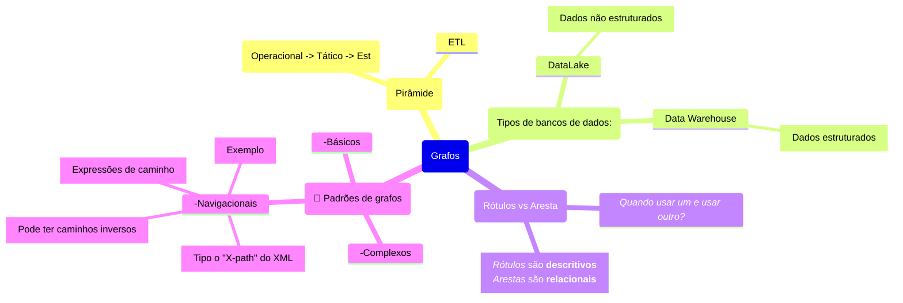

```mermaid
mindmap
	Root(Grafos)
		(Pirâmide)
			("Operacional -> Tático -> Est")
			ETL

		(Tipos de bancos de dados:)		
			DataLake
				[Dados não estruturados]
			Data Warehouse
				[Dados estruturados]

		(Rótulos vs Aresta)
			*Quando usar um e usar outro?*
			[*Rótulos* são **descritivos**
			*Arestas* são **relacionais**]

		(🔑 Padrões de grafos)
			-Básicos
			-Complexos
			-Navigacionais
				[Tipo o "X-path" do XML]
				["Expressões de caminho"]
				[Pode ter caminhos inversos]
				[Exemplo]


			
```
