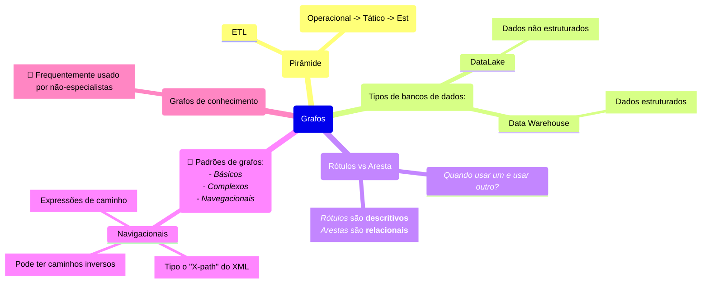
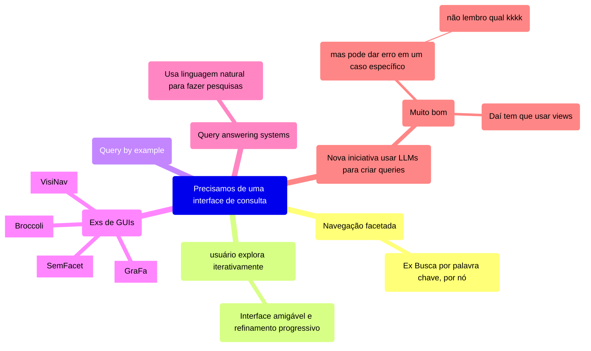
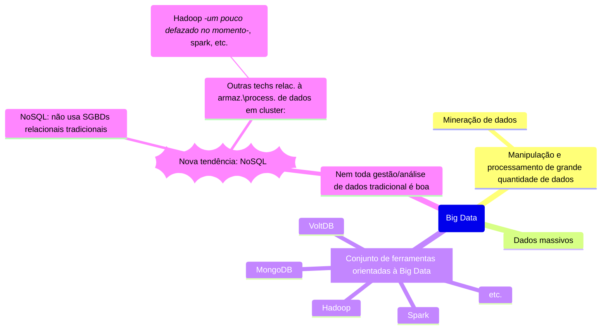

# Parte 1: Grafos

(Grafos de conhecimento)
🤔 Frequentemente usado por não-especialistas

# Parte 2: Tecnologia de Big Data

NoSQL não significa que é SQL, só que não é relacional.

Precisamos de profissionais que lidam com grande volume de dados.

Analisar dados sempre existiu, mas agora temos demandas para especialistas (como engenheiro de dados, analista de dados, engenheiro de ML, etc.)

**Hadoop** é baseado em *MapReduce*. Apesar ser muito bom para simplificar, nem tudo pode ser solucionado com essa abordagem. *Map Reduce: Mapeia e reduz, agregando resultados.*

## Cientista de dados x Engenheiro de dados
- **Cientista de dados**:
	- Trabalha com a **descoberta de conhecimento** usando a análise de dados.
	- Utilizam técnicas matemáticas e algoritmos para solucionar problemas de negócio.
- **Engenheiro de dados**:
	- Trabalha para processar e tratar dados pra serem usados em aplicações de Big Data.
	- Utilizam conhecimento de ciência da computação p/ criar sistemas e resolver problemas de processamento de dados em **tempo real** e manipular quantidades imensas de dados.

## **Cinco "Vês" do Big Data**
- Volume 
- Velocidade
- Variedade
- Veracidade
- Valor

## Caracterização de Big Data
Pode ser caracterizado por :
- **Grande volume de dados**: Terabytes, Petabytes, etc.
- **Tipos de dados variados**: Armazenamento de dados complexos.
- **Armazenamento em clusters**: Clusters de processadores de baixo custo, distribuídos de forma transparente.
- **Poder de crescimento elástico horizontal**: Alocação/desalocação de recursos sob demanda.

# Cloud Computing
Tem recentemente sido utilizados para o gerenciamento de dados em Big Data.
DaaS -> Data as a Service
IaaS -> Infrastructure as a Service

Cloud permite escalabilidade, elasticidade, funcionamento em *commodity* hardware.

Cloud pode ser:
- Single Tenant; ou
- Multitenant.

# Big Data: Por que o interesse agora?
Fontes de dados diversificados, de vários lugares, em grande peso. 
Os dados são valiosos demais para serem deletados.
Nos últimos tempos, houve uma redução drástica no custo do hardware, principalmente no de armazenamento.
Também houve um crescimento de soluções de Cloud.

Gerenciamento de dados foi **Democratizado**.

# Tecnologias NoSQL:
"Not Only SQL"
Não precisam de um schema fixo, não usam junções, e relaxam uma ou mais das propriedades ACID de BDs:

**ACID:**
- *Atômica*: Ou faz tudo, ou não faz nada.
- *Consistência*: Uma transação tem que não pode mudar outras coisas no BD.
- *Isolamento*: Controle de concorrência, duas transações não podem interferir uma a outra.
- *Durabilidade*: Mudanças por transações efetivadas devem persistir sem importar falhas.

Teorema **CAP**:
- *Consistência*:
- *Alta disponibilidade*:
- *Partição*:

.
.
.
.
.
.
.
.
.
.
.
.
.
.
.
.
.
.
.
.
.