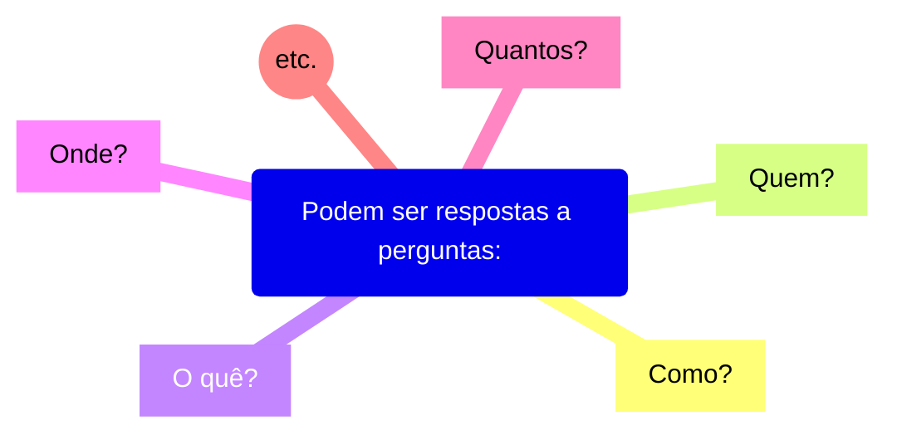
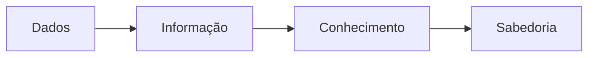
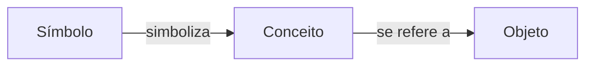
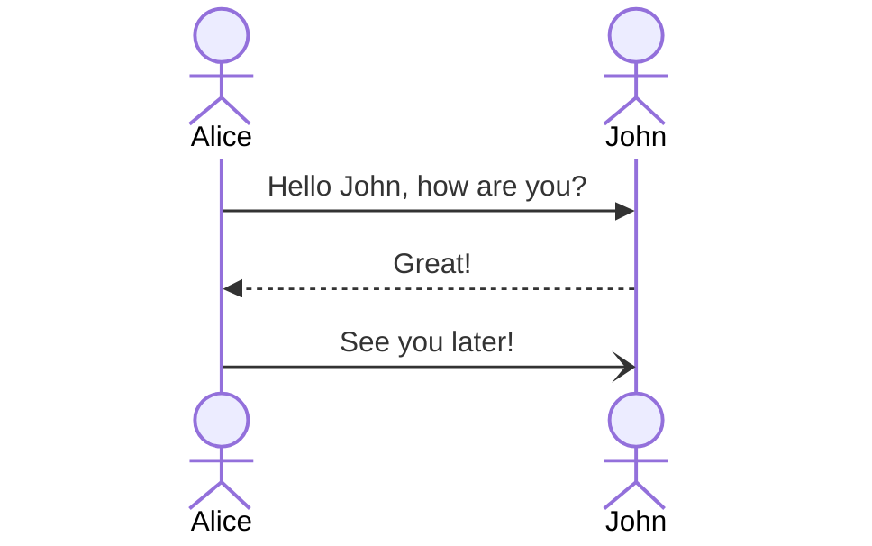

# Conceitos
Dos dados ao conhecimento: como vamos representá-los?

Exemplos:
* Quantidade,
* Ponto no tempo,
* Período,
* etc.

Tudo isso são dados. Eles são a matéria prima dessa área de estudo.

Dados não existem e não tem significado além da sua existência (pelo menos em si mesmo). Eles tem várias formas, sendo utilizáveis ou não.

# Informação

É o dado que recebeu um significado por meio de uma conexão relacional.

Pode ser útil, mas não precisa ser. As informações são contidas nas descrições.

# Conhecimento, sabedoria e compreensão

### Conhecimento:
É a coleta apropriada de info, com intenção dela ser útil.

### Sabedoria:
É a capacidade de fazer julgamento e decisões sensatas.

### Compreensão (entendimento)
É um continuum que leva dos dados, informação, conhecimento e sabedoria.

Conhecimento é um **subconjunto justificado** de todas as crenças verdadeiras.

# Representação formal do conhecimento:

Segundo Davenport e Prusak (1997): "As pessoas não podem compartilhar conhecimento se não falarem uma ***linguagem comum***".

Para essa ***linguagem comum***, precisamos de:
* **Sintaxe:** Símbolos e conceitos comuns;
* **Semântica:** Acordo sobre o seus significados;
* **Taxonomia:** Classificação de conceitos;
* **Tesauros:** Associações e relações de conceitos;
* **Ontologias:** Regras e conhecimento sobre que relações são permitidas e fazem sentido.

# Linguagem como representação do conhecimento

A Linguagem, mais especificamente a **Linguagem Natural**, pode ser usada para representar o conhecimento. Ela é a maneira mais antiga que nós descobrimos para fazer essa representação.

### Mas o que exatamente é "linguagem" nesse contexto?

Uma **Linguagem** é um sistema de **símbolos** convencionais **falados**, **manuais** ou **escritos** que se combinam para **transmitir um significado**.

Por meio dela, nós humanos (como membros de um grupo social e/ou cultural) expressamos idéias complexas e abstratas.

Uma das maiores funções de uma linguagem é a **comunicação.**

# Comunicação e significado
A comunicação é a transmissão de informações entre 1 à N indivíduos através de um meio.

Exemplo de uma comunicação:

.
.
.
.
.
.
.
.
.
.
.
.
.
.
.
.
.
.
.
.
.
.
.
.
.
.
.
.