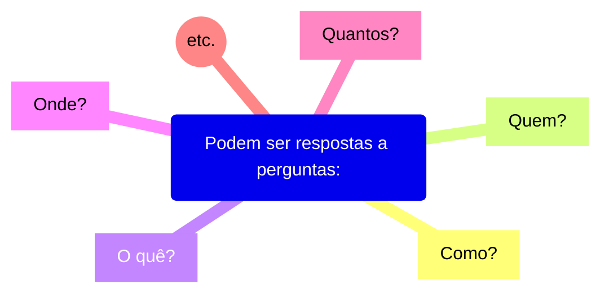
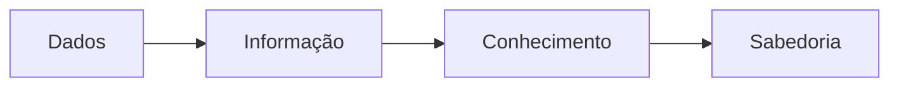
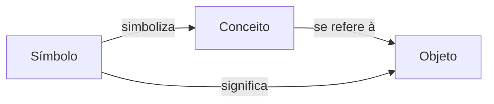
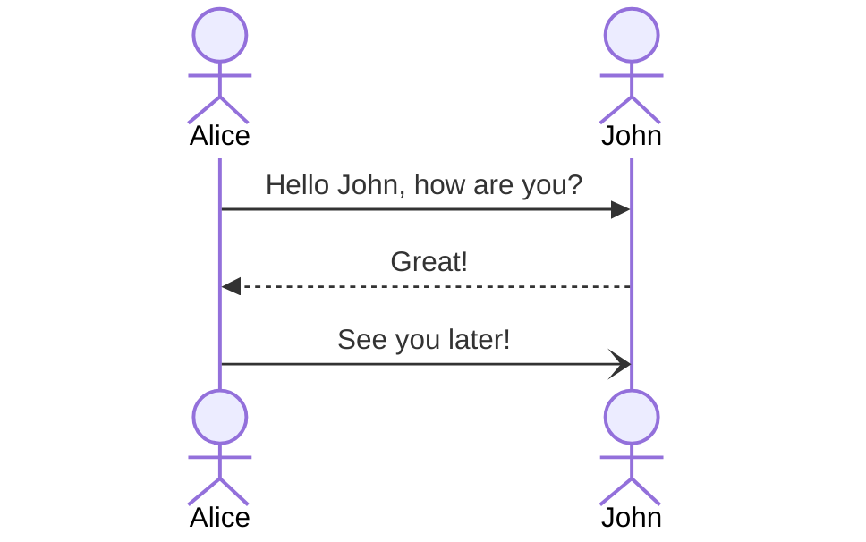
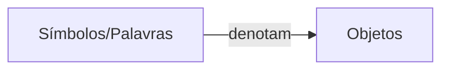

# Conceitos
Dos dados ao conhecimento: como vamos representá-los?

Exemplos:
* Quantidade,
* Ponto no tempo,
* Período,
* etc.

Tudo isso são dados. Eles são a matéria prima dessa área de estudo.

Dados não existem e não tem significado além da sua existência (pelo menos em si mesmo). Eles tem várias formas, sendo utilizáveis ou não.

# Informação

É o dado que recebeu um significado por meio de uma conexão relacional.

Pode ser útil, mas não precisa ser. As informações são contidas nas descrições.

# Conhecimento, sabedoria e compreensão

### Conhecimento:
É a coleta apropriada de info, com intenção dela ser útil.

### Sabedoria:
É a capacidade de fazer julgamento e decisões sensatas.

### Compreensão (entendimento)
É um continuum que leva dos dados, informação, conhecimento e sabedoria.

Conhecimento é um **subconjunto justificado** de todas as crenças verdadeiras.

# Linguagem como representação do conhecimento

A Linguagem, mais especificamente a **Linguagem Natural**, pode ser usada para representar o conhecimento. Ela é a maneira mais antiga que nós descobrimos para fazer essa representação.

### Mas o que exatamente é "linguagem" nesse contexto?

Uma **Linguagem** é um sistema de **símbolos** convencionais **falados**, **manuais** ou **escritos** que se combinam para **transmitir um significado**.

Por meio dela, nós humanos (como membros de um grupo social e/ou cultural) expressamos idéias complexas e abstratas.

Uma das maiores funções de uma linguagem é a **comunicação.**

# Comunicação e significado
A comunicação é a transmissão de informações entre 1 à N indivíduos através de um meio.

Exemplo de uma comunicação:

Porém a Linguagem Natural (LN) **não é perfeita**: ela é afligida por coisas como **Ambiguidade**, **Parafraseio**, etc...

Por isso precisamos de uma **representação formal do conhecimento**: Para podermos lidar com ele sem precisar lidar com a linguagem natural e todas as suas imperfeições.

Assim, as máquinas que lidarão com esses conhecimento vão ser capazes de entender o seu conteúdo e interpretá-los corretamente.

# Representação formal do conhecimento:

A Representação Formal do conhecimento é do campo da **Inteligência Artificial (IA)**.

Segundo Davenport e Prusak (1997): "As pessoas não podem compartilhar conhecimento se não falarem uma ***linguagem comum***".

Para essa ***linguagem comum***, precisamos de:
* **Sintaxe:** Símbolos e conceitos comuns;
* **Semântica:** Acordo sobre o seus significados;
* **Taxonomia:** Classificação de conceitos;
* **Tesauros:** Associações e relações de conceitos;
* **Ontologias:** Regras e conhecimento sobre que relações são permitidas e fazem sentido.

Assim, a máquina será capaz de fazer a captura da semântica de **conceitos**, **propriedades**, **relacionamentos** e **entidades**

# Significado
O **Significado** é um **relacionamento** entre dois tipos de coisas:
* Símbolos; e
* Objetos.

Palavras (e outros símbolos não verbais) são necessariamente **significativas**, ou seja, possuem algum significado.

# Entendimento
Entendimento é, em geral, a capacidade de **captar o significado** de uma determinada **informação**.

Essas informações são transmitidas em uma **mensagem**, que usa uma linguagem específica, de um **remetente** para um **receptor**

A informação é considerada **entendida** pelo receptor se esse conseguir **interpretar sucedidamente** a informação contida na mensagem.

Para uma interpretação correta, precisa-se das características de uma linguagem comum que foi discutida anteriormente:
* Sintaxe;
* Semântica;
* Contexto;
* Pragmática;
* Experiência;
* etc.

### Sintaxe:
A **Sintaxe** vem do Grego que significa: Arranjo, Ordenação.

Na gramática, ela denota o estudo dos princípios e processos pelos quais as frases são construídas em línguas específicas.

Já em linguagens formais, ela é um **subconjunto de regras** pelas quais expressões bem formadas podem ser criadas a partir de um conjunto fundamental de símbolos.

Por exemplo:
* *Essa frase não verbo.* ❌️
* *A frase anterior não **tem** verbo.* ✅️

### Semântica
A **Semântica** vem do Grego, que se diz respeito ao **caráter**, ao **estudo do significado**.

Na  linguística, ela é a parte que se concentra no **sentido** e no **significado** da linguagem (ou símbolos da linguagem).

Ela é o **estudo da interpretação de sinais ou símbolos**, que são usados por agentes ou comunidades em **circunstâncias e contextos específicos**.

A **Semântica** pergunta como o sentido e o significado de conceitos complexos podem ser 
.
.
.
.
.
.
.
.
.
.
.
.
.
.
.
.
.
.
.
.
.
.
.
.
.
.
.
.