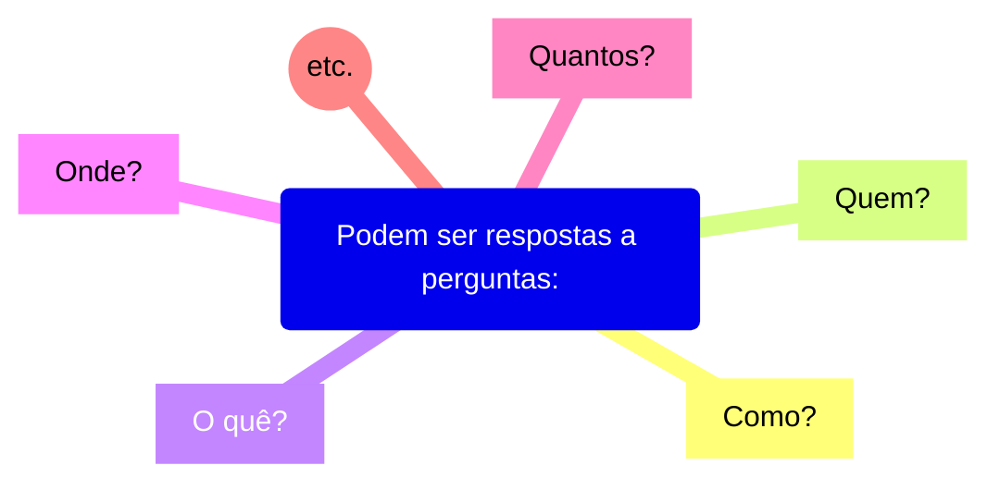
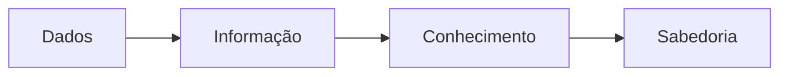

# Conceitos
Dos dados ao conhecimento: como vamos representá-los?

---

Exemplos:
* Quantidade,
* Ponto no tempo,
* Período,
* etc.

Tudo isso são dados. Eles são a matéria prima do estudo.

---

Dados não existem e não tem significado além da sua existência (pelo menos em si mesmo). Eles tem várias formas, sendo utilizáveis ou não.

# Informação

É o dado que recebeu um significado por meio de uma conexão relacional.

Pode ser útil, mas não precisa ser. As info são contidas nas descrições.

# Conhecimento

Conchecimento é a coleta apropriada de info, com intenção dela ser útil.

Sabedoria é a cap de fazer julg e decis sensatas.

Compreensão (entendimento) é um continuum que leva dos dados, informação, conhecimento e sabedoria.

Conhecimento é um **subconjunto justificado** de todas as crenças verdadeiras.

## Precisamos de uma representação formal do conhecimento:

Segundo Davenport e Prusak (1997): "As pessoas não podem compartilhar conhecimento se não falarem uma ***linguagem comum***".

Para essa ***linguagem comum***, precisamos de:
* **Sintaxe:** Símbolos e conceitos comuns;
* **Semântica:** Acordo sobre o seus significados;
* **Taxonomia:** Classificação de conceitos;
* **Tesauros:** Associações e relações de conceitos;
* **Ontologias:** Regras e conhecimento sobre que relações são premitidas e fazem sentido.

.
.
.
.
.
.
.
.
.
.
.
.
.
.
.
.
.
.
.
.
.
.
.
.
.
.
.
.